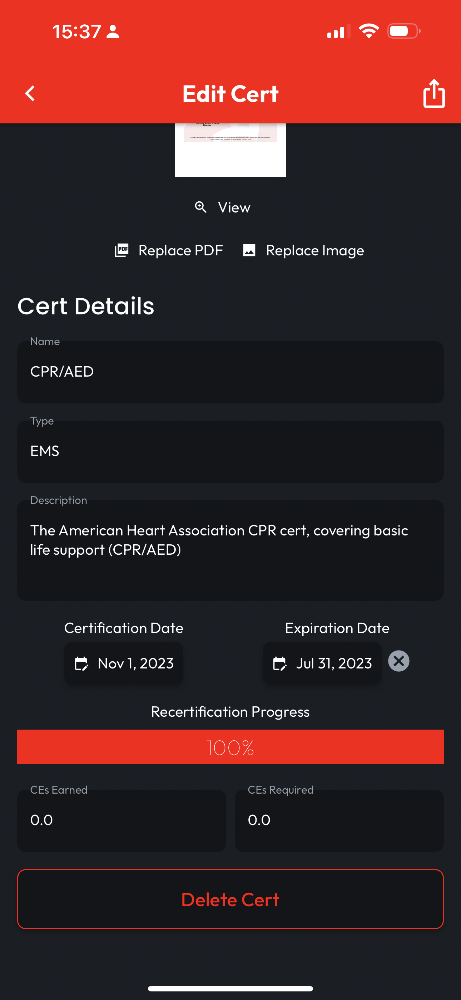
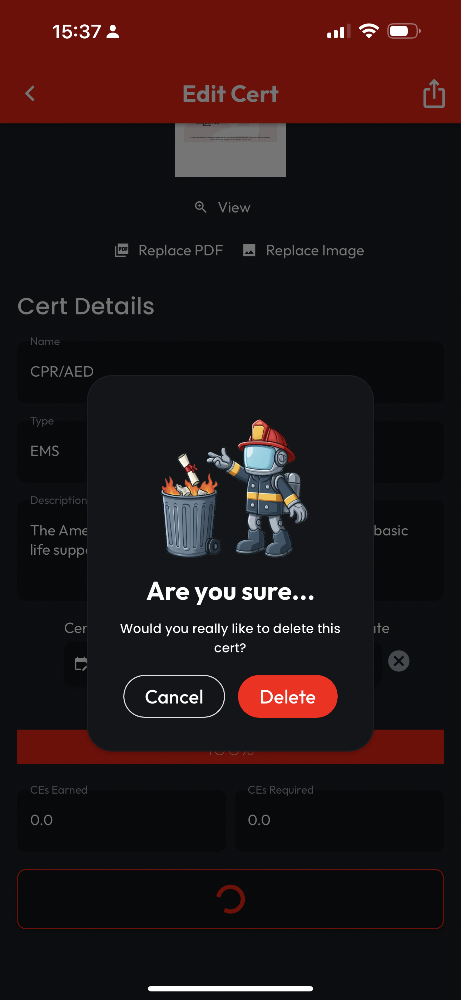

# Deleting a Cert

## Tap to Open

When looking at your Locker, **Tap a Cert** to open the **Edit Cert** page, then scroll down past the **Thumbnail**.

## Delete Cert & Confirm

Tap **Delete Cert** at the bottom of the screen, then confirm on the dialog that pops up by tapping **Delete**. You'll then be routed back to your **Locker**, where you'll find your changes reflected.

<figure><figcaption></figcaption></figure>

 

<figure><figcaption></figcaption></figure>

