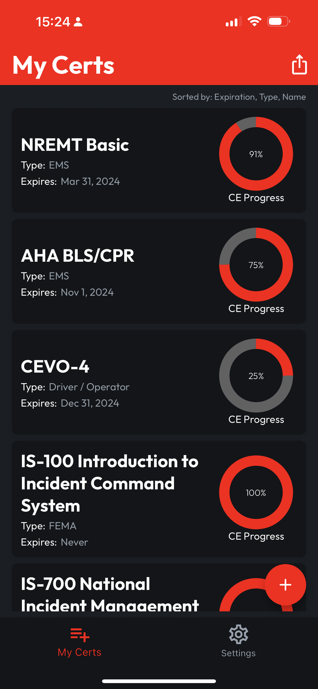
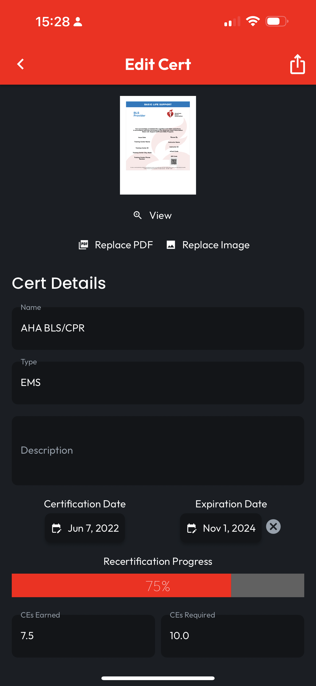
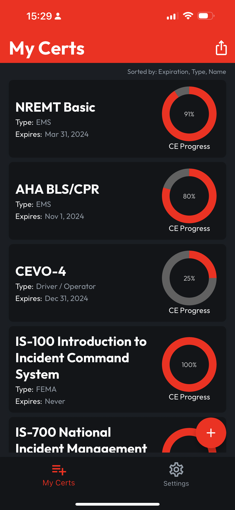

# Tracking CE Progress

## View in Locker

You can see the recorded **CE Progress** for all your Certs with a glance in your **Locker**. From there, **Tap a Cert** to open the **Edit Cert** page.

<figure><figcaption></figcaption></figure>

## Modify CE Fields

The **CEs Earned** and **CEs Required** fields will autosave if you make changes, and as they do, you'll see the **Recertification Progress** bar recalculate and update to reflect CEs you've earned or changes to the requirements.

<figure><figcaption></figcaption></figure>

 

<figure><figcaption></figcaption></figure>

## Return to Locker

Use the **Back Button** to return to your **Locker**, where you'll see your changes reflected.

<figure><figcaption></figcaption></figure>
