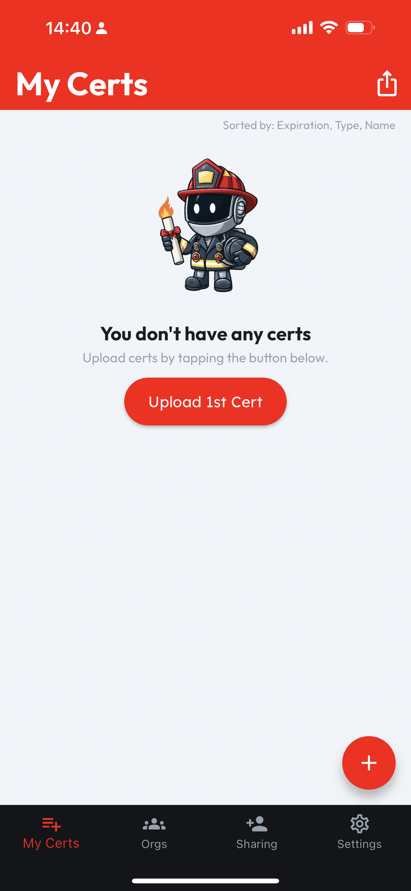
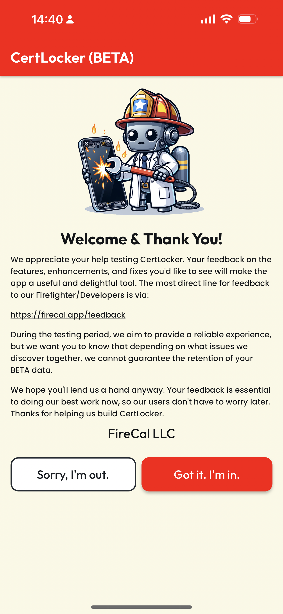

# Uploading Certs

## The First Cert

When you first access your empty Locker, you'll meet CertBot and see a button to **Upload 1st Cert**. To start your Cert collection, you can tap **Upload 1st Cert**, or use the **Floating Action Button (FAB)**, which is the red circle and "+" sign at the bottom right.

You'll be welcomed, shown a link to our [Feedback](https://firecal.app/feedback-support) page, and prompted to acknowledge that you understand this BETA is a test build, and so may have issues we couldn't find until we brought in more users for testing, like you!

Tapping "**Got it. I'm in."** will record your acknowledgement and direct you to the **Create Cert** screen.&#x20;

<figure><figcaption></figcaption></figure>

 

<figure><figcaption></figcaption></figure>

If you're having second thoughts about participating in the BETA, tapping "**Sorry. I'm out."** will log you out, and then we'd appreciate [any helpful input you can offer](https://form.asana.com/?d=1107920631423484\&k=QipQafA-VqMyE4VOj0FjYA) on why CertLocker wasn't for you. If you change your mind later, simply login with the account you registered, follow the same steps above, but this time, tap "**Got it. I'm in."**

## Enter Cert Data

**Name** your Cert, then enter a **Type**, which should reflect the working role, industry, or issuing agency for your Cert, eg. **Name**: _Firefighter 1_, **Type**: _Structure Firefighting_.

During the BETA, we'll aggregate common values for **Name** and **Type** to help us build a list of preloaded Certs to include in CertLocker at launch.

Add a **Description** or use that field for any notes that you'll find helpful, the input how many **CEs Earned** towards renewal and the total **CEs for renewal**. These values will be used to calculate your **Recertification Progress**, shown elsewhere in the App.

Pick the **Certification Date** when you earned this Cert, then pick the **Expiration Date**. If this Cert never expires, don't select any value, or if you did by mistake, you can tap the circled "X" to reset your **Expiration Date** to **Never**.

<figure><figcaption></figcaption></figure>

Finally, to attach a digital version or image of your Cert, tap **PDF** or **Image**. For PDFs, you'll be presented with your device's file picker, and you can navigate to your digital copy of this cert. For images, you'll be asked whether you'd like to select from your device's **Gallery** or use the **Camera** to create an image of your paper Cert. Select your image or take a photo of your Cert.

(Tip: If you're having trouble making out the images of **Certs** in your **Gallery**, you can zoom with **Pinch-to-Zoom** or a zoom slider, depending on your operating system.)

CertLocker will display an **Uploading** message at the bottom and a **Success** message when it is done (see the image below). When you're finished, tap **Create**.

**NOTE**: Image attachments will be saved in the cloud and a PDF will be created for compatibility among all your Certs throughout the app.

<figure><figcaption></figcaption></figure>

If any **Required Fields** are missing, or if a valid **Attachment** hasn't been added, CertLocker will prompt you to remedy the issue. If nothing is missing, your Cert will be created, and you'll be routed back to your Locker, where you'll see your **First Cert**!

<figure><figcaption></figcaption></figure>

## Adding More Certs

After you've added your First Cert, add more Certs using the **FAB** (red circle with "+") at the bottom right of your **Locker,** following the same steps above. In the CertLocker BETA, your Locker defaults to sorting by **Expiration Date**, **Type**, and then **Name**.
