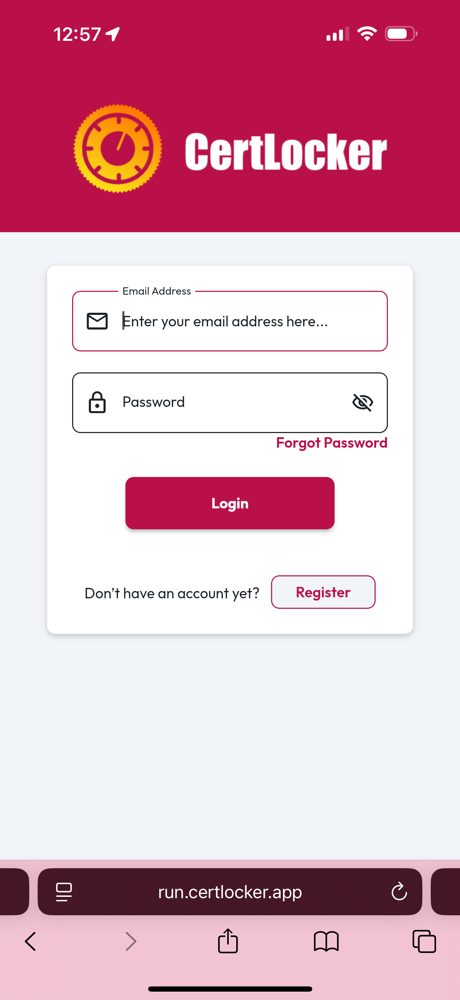

# Access on Mobile

CertLocker is available for iOS and Android or as a mobile webapp. Use the links below to find CertLocker in your App Store of choice or to load in the browser, where you can add to your homescreen as a progressive webapp.

Tap **Get** or **Install**, and once it's finished downloading, open the app to register.

[Download for iOS](https://apps.apple.com/us/app/certlocker/id6468518382), [Download for Android](https://play.google.com/store/apps/details?id=certlocker.Do\&pcampaignid=web_share), [Use your mobile web browser](http://run.certlocker.app/)

<figure><figcaption></figcaption></figure> <figure><figcaption></figcaption></figure>

