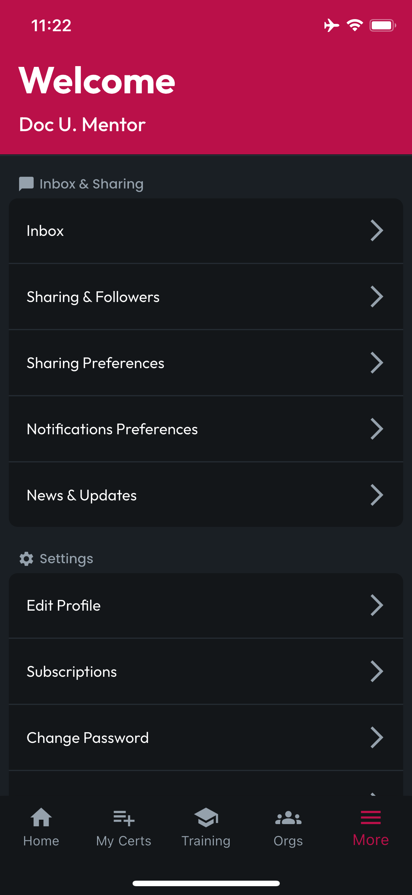
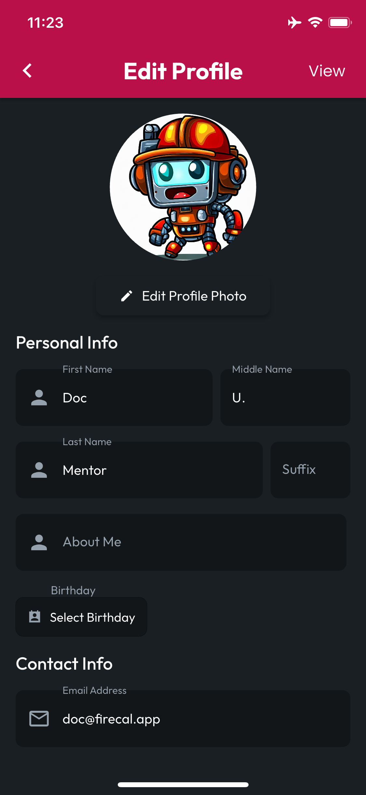
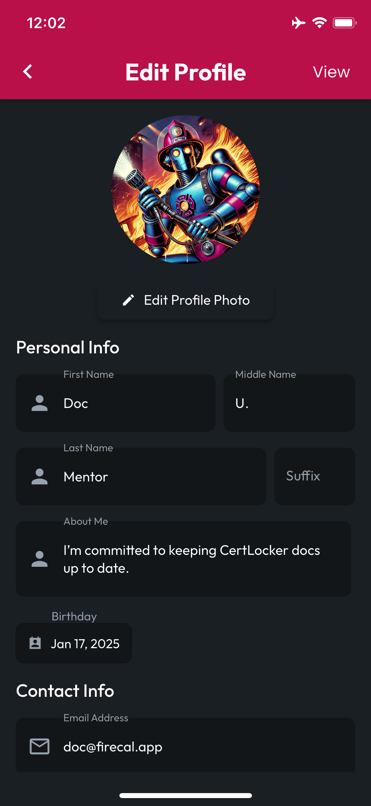
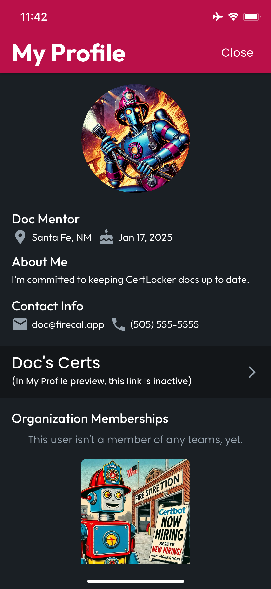

# Create Your Profile

## Tap More at the Bottom

Tapping on the More navbar item at the bottom of the screen will bring you to the More Screen, which provides several options worth exploring. For now, we're going to focus on creating your profile.

<figure><figcaption></figcaption></figure>

## Edit Profile

Tap on the **Edit Profile** button to navigate to the Edit Profile screen.

## Update Your Profile Photo

Tap **Edit Profile Photo**, and choose whether you want to select an image from your Gallery or open up your device's camera. When you choose or take the photo you want, CertLocker will replace the default image.

## Complete Your Profile

Complete the fields shown on the **Edit Profile** screen. CertLocker will autosave as you go! If there's anything you would like to exclude, don't worry about it, none of these fields are required, though certain features like Email & SMS notifications will not work without a valid email address or phone number.

**IMPORTANT**: Updating your email address in your profile only changes the email address we'll use to contact you. In this early version of CertLocker, to update your login address, [please submit a support request](https://form.asana.com/?k=9ZDd1YrRWfsneFrr01xdug\&d=1107920631423484).

<figure><figcaption></figcaption></figure> <figure><figcaption></figcaption></figure>

## Preview Your Profile

When you've updated your profile image and entered all your personal details, to preview your profile, click the **View** button in the top right corner of the **Edit Profile** screen. This will take you to the **My Profile** screen, where you can see what your profile will look like to other users in CertLocker. Tap the **Close** button to return to the **Edit Profile** screen.

<figure><figcaption></figcaption></figure>
