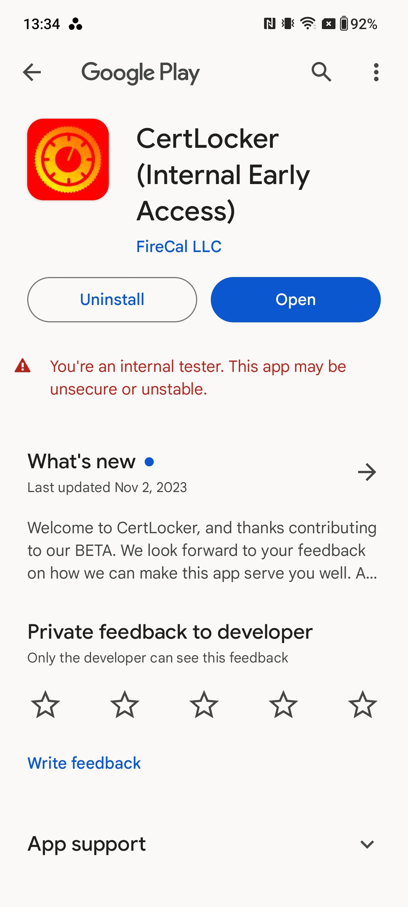

# BETAs on Android

## Look for your invite

When you've been added to the CertLocker BETA on Android, you'll receive an email from noreply@firecal.app with Subject: Welcome to the CertLocker BETA on Android

<figure><figcaption></figcaption></figure>

## View in the Google Play Store

Open the link from the email, and install CertLocker using your Google Play credentials, or whatever method of biometric authentication you've enabled.

<figure><figcaption></figcaption></figure>

## Managing your installation

In the Google Play store, you can follow what's new, manage updates, provide feedback, uninstall the app, and find links to resources (like the docs you're viewing now!).

<figure><figcaption></figcaption></figure>

## Lost your invite?

If you lose track of the invite email, as long as you're a registered tester, you can install the app from [https://play.google.com/store/apps/details?id=certlocker.Do](https://play.google.com/store/apps/details?id=certlocker.Do)

## Still having trouble?

If you're still having problems, please our Support Team is ready to help. Simply create a Support ticket here: [https://form.asana.com/?k=9ZDd1YrRWfsneFrr01xdug\&d=1107920631423484](https://form.asana.com/?k=9ZDd1YrRWfsneFrr01xdug\&d=1107920631423484)
