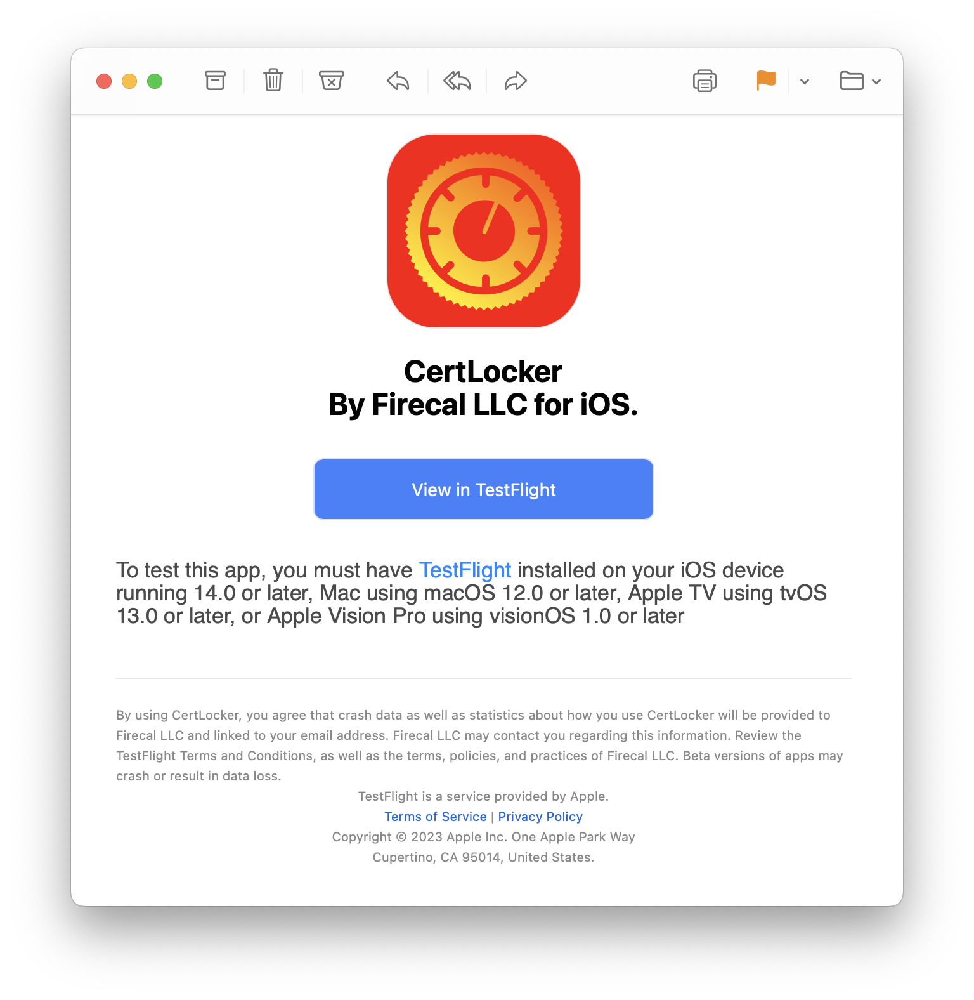
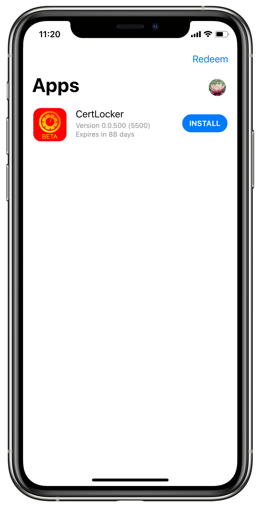
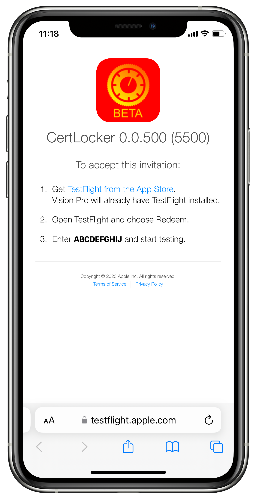
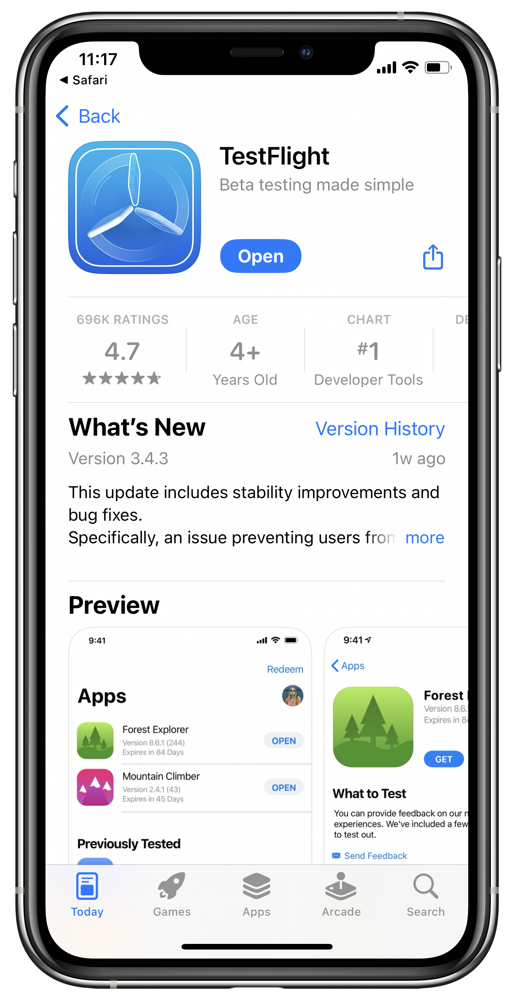
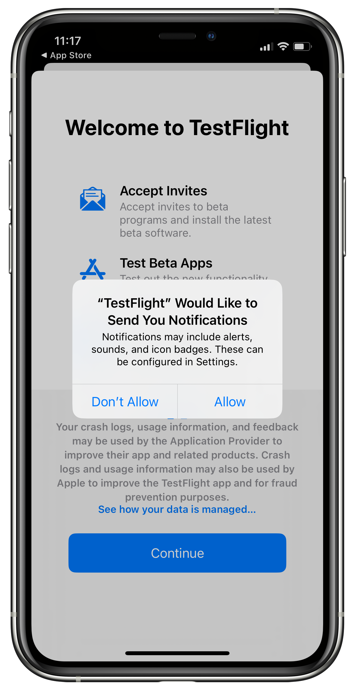
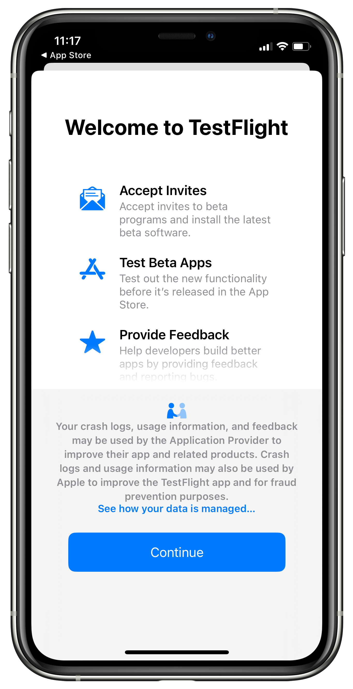
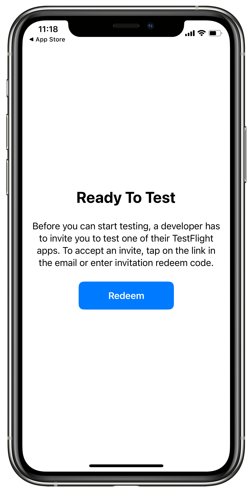
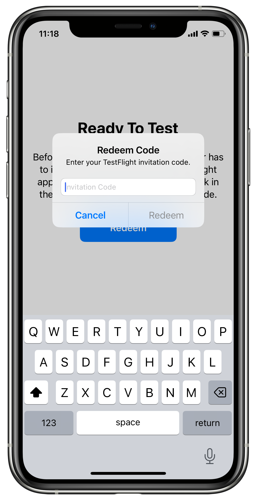

# BETAs on iOS, iPadOS & macOS

## Install TestFlight

BETAs on all Apple platforms are installed using TestFlight, which you can download here: [https://apps.apple.com/us/app/testflight/id899247664](https://apps.apple.com/us/app/testflight/id899247664)

## Look for your invite

When you've been added to the CertLocker BETA on iOS, you'll receive an email from [no\_reply@email.apple.com](mailto:no\_reply@email.apple.com) with Subject: Firecal LLC has invited you to test CertLocker.

In the invite email, tap/click the blue **"View in TestFlight"** button.

<figure><figcaption></figcaption></figure>

## Notifications

When you tap/click the blue button in the invite email, TestFlight will open if already installed and ask for permission to send notifications, which will alert you when there are updates to the apps you're testing.

## Welcome to TestFlight

TestFlight will then show a Welcome screen with details about the app. **Tap/Click Continue**.

## Apps

The TestFlight home screen is a simple list of apps you're testing. You should find **CertLocker** listed with an install button, which you can tap/click to get the app.

<figure><figcaption></figcaption></figure>

## Troubleshooting

### Maybe you opened the email before installing TestFlight

If things didn't go as described above, it's most likely a result of opening the link in the email before installing TestFlight, which will take you to the following screen:

<figure><figcaption></figcaption></figure>

### Copy the invite code

Select the bold invite code in step three (Tap and hold on iOS/iPadOS, click and drag to select on macOS), then copy it to your clipboard (Tap Copy on iOS/iPadOS. On macOS press Command+C or right-click and choose copy).

### Follow the link to "Get TestFlight from the App Store"

When you're on the TestFlight page in the App Store, select "Install" to download TestFlight. You may need to enter your username and password, or use whatever biometric authentication you've enabled for you iCloud account. When the installation is complete, tap Open.

<figure><figcaption></figcaption></figure>

### Choose your notification preferences and tap Continue

TestFlight will request permission to send you notifications, which will let you know when apps you're testing receive updates, or when their expiration date is approaching. Choose your preference, then tap **Continue**.

<figure><figcaption></figcaption></figure>

 

<figure><figcaption></figcaption></figure>

### Redeem your Invite Code

Tap the blue Redeem button, then paste the code you copied earlier (tap in the text field and choose Paste on iOS/iPadOS. On macOS, press Command+V or right-click and choose paste). Tap Redeem to confirm. This will grant you access to install CertLocker and view it on the Apps screen in TestFlight.

<figure><figcaption></figcaption></figure>

 

<figure><figcaption></figcaption></figure>

## Still having trouble?

If you're still having problems, please our Support Team is ready to help. Simply create a Support ticket here: [https://form.asana.com/?k=9ZDd1YrRWfsneFrr01xdug\&d=1107920631423484](https://form.asana.com/?k=9ZDd1YrRWfsneFrr01xdug\&d=1107920631423484)
