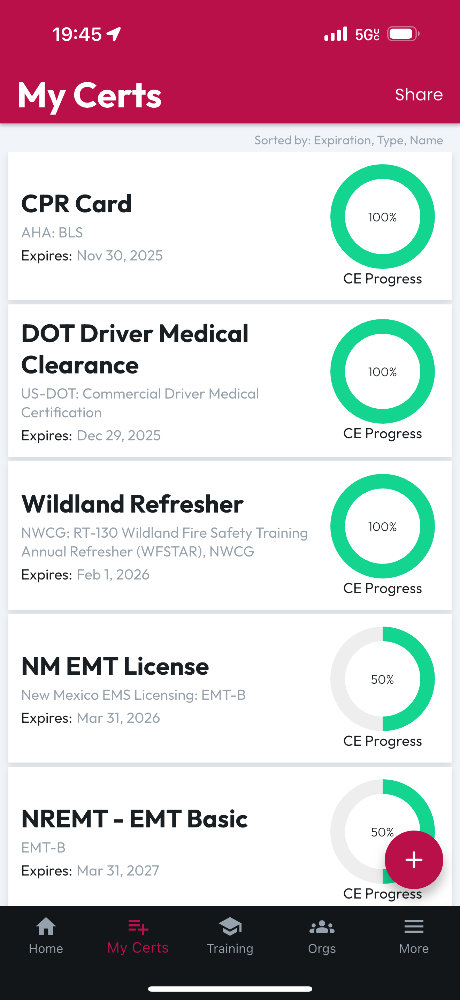
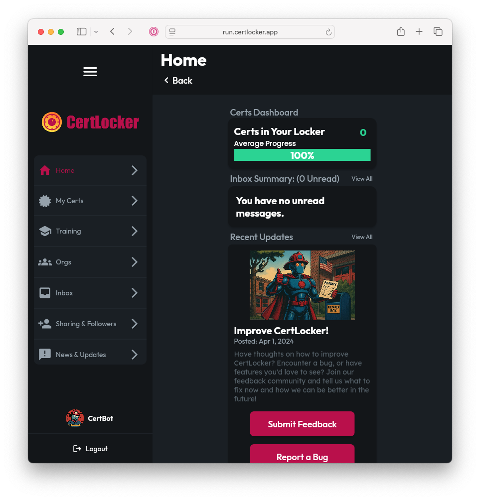
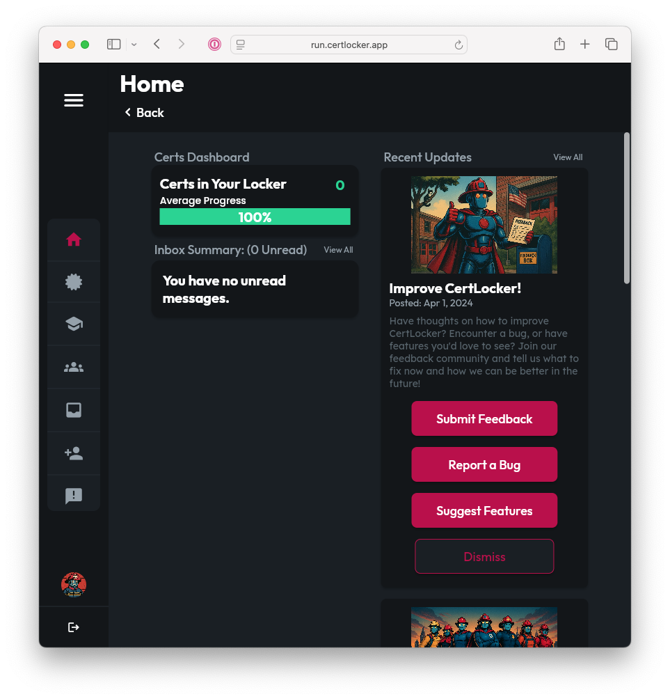

# Mobile vs Desktop/Tablet/Web

Most of your experience using CertLocker is essentially identical, regardless of the platform or size of screen where you use the app.

The biggest difference you will see is that on smaller screens like mobile phones and smaller tablets, your primary navigation will be done at the bottom, with a navbar, and typically in web browsers on larger tablets, laptops, and desktop monitors, unless you constrain the browser window size, you'll navigate with a sidebar on the left.

## Going Mobile: The Bottom Navbar

On smaller screens, the most commonly utilized pages in CertLocker are accessible at the bottom of the app. This makes them easier to reach when holding a phone with one hand. The current page will be highlighted in red.

<figure><figcaption></figcaption></figure>

Any pages that aren't listed along the bottom can be found by tapping the [**More**](../more/more-options.md) item in the bottom navbar.


FUN FACT: Wherever you access CertLocker, you're actually running the same app! Based on the size of the window or screen available, the app will automatically adjust to use either the sidebar or bottom navbar.


## On the Big Screens: The Sidebar

Larger screens are typically landscape oriented, leaving more room for navigational UI at the sides. When using CertLocker in a larger window, the bottom navbar will disappear and the sidebar will appear on the left.

The sidebar includes a longer list of commonly used pages than can fit on the mobile navbar. To access settings and other screens not listed in the sidebar, tap on your user profile image or display name toward the bottom of the sidebar.

#### Expanded or Collapsed

The sidebar can be toggled between an expanded and collapsed view, based on whether you prefer easy to read buttons for finding the pages you're looking for or smaller icon-only view to give the main application canvas more room to show off your Certs.

<figure><figcaption>
Sidebar: Expanded
</figcaption></figure>

<figure><figcaption>
Sidebar: Collapsed
</figcaption></figure>

As you refer to the documentation that follows, you will find a mix of mobile and desktop images to help you find your way around on any platform you use to access your Certs.
