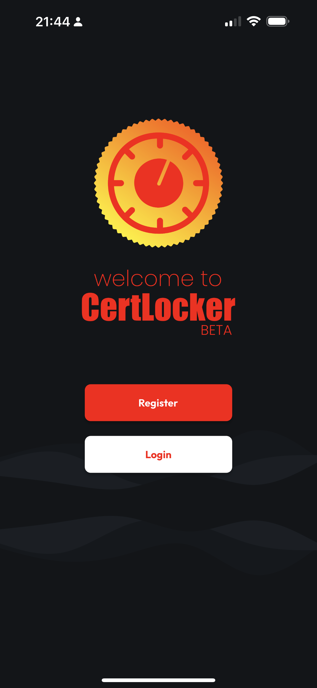

# Registration

## Select Register on the Welcome Screen

Welcome! Now that you've got the app installed, just click register...

## Complete the Registration Form

Add your full name, you preferred email for authentication and communications form our team, and a secure password (ideally created with a password manager).

Make sure your password entries match, and if you need to view them to confirm, use the show/hide buttons in the password fields.

## Tap/Click Create Account

CertLocker will validate your submission, and as long as inputs look good, you're in! If any issues are detected, you should see a notice with instructions on what's wrong (something like password mismatch, invalid email formatting, or email already in use).
