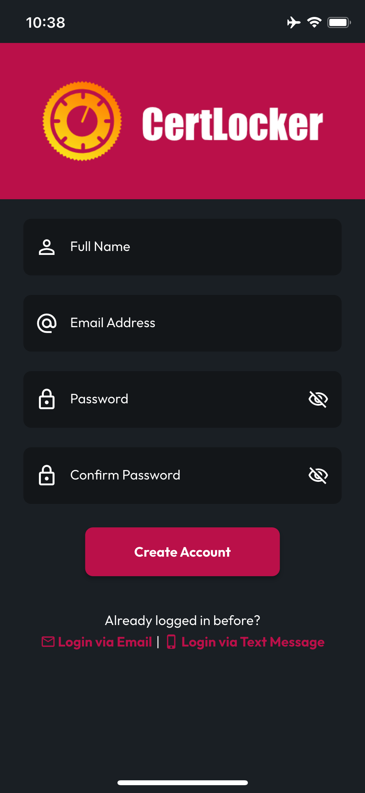

# Registration

## Select Register on the Welcome Screen

Welcome! Now that you've got the app installed, tap register to create an account using your email address.

## Complete the Registration Form

Add your full name, you preferred email for authentication and communications from our team, and a secure password (ideally created with a password manager).


**We recommend using your personal email address**, even if you're using CertLocker with an employer organization. CertLocker is built with individual responders in mind, so the Certs _you earn_ can follow you throughout your career.


Make sure your password entries match, and if you need to view them to confirm, use the show/hide buttons in the password fields.

<figure><figcaption></figcaption></figure> <figure><figcaption></figcaption></figure>

## Tap Create Account

CertLocker will validate your submission, and as long as all the inputs look good, you're in! If any issues are detected, you will see a notice with instructions on what's wrong (something like password mismatch, invalid email formatting, or email already in use).

## Phone-Only Registration

If you don't have an email address or prefer to register using just your phone, tap Login via Text Message, where the Phone Login screen doubles as Registration and Login. Enter your phone number, then tap submit. You'll be routed to the Verify Code screen, and you'll receive a text message with the code to enter in the field provided, then tap Submit.

<figure><figcaption></figcaption></figure> <figure><figcaption></figcaption></figure>

## Success!

With successful registration, you'll see a welcome message, and after you've finished with it, you'll be routed to the Home screen, where you can begin exploring what CertLocker has to offer. We recommend you start by navigating to My Certs to upload your first Cert, or head over to Settings to upload a profile photo and create your user profile.

<figure><figcaption></figcaption></figure> <figure><figcaption></figcaption></figure>

