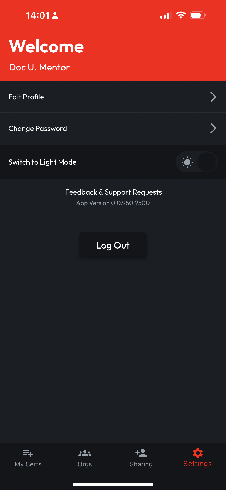
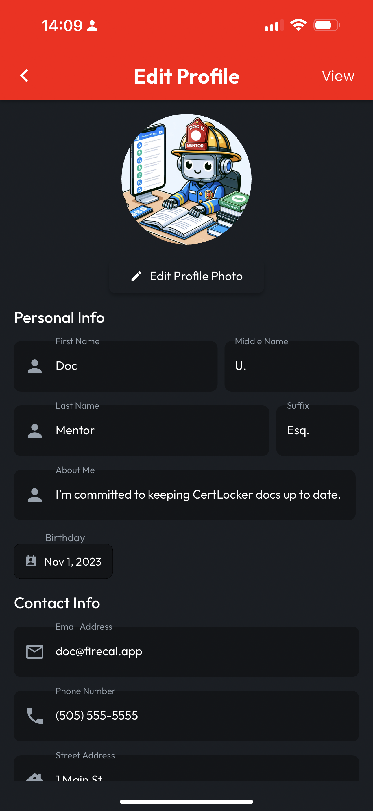

# Settings & Profile

## Navigate to Settings

Tapping on the Settings navbar item at the bottom of the screen will bring you to the Settings Screen. From here, you can:

* Edit your profile information
* Change your password
* Switch the app between light and dark mode

<figure><figcaption></figcaption></figure>

## Edit Profile

Tap on the Edit Profile button to navigate to the Edit Profile screen.

## Update Your Profile Photo

Tap **Edit Profile Photo**, and choose whether you want to select an image from your Gallery or open up your device's camera. When you choose or take the photo you want, CertLocker will replace the default image.

<figure><figcaption></figcaption></figure>

## Complete Your Profile

Complete the fields shown on the **Edit Profile** screen. CertLocker will autosave as you go! If there's anything you would like to exclude, don't worry about it, none of these fields are required.

**IMPORTANT**: Updating your email address in your profile only changes the email address we'll use to contact you. In this early version of CertLocker, to update your login address, [please submit a support request](https://form.asana.com/?k=9ZDd1YrRWfsneFrr01xdug\&d=1107920631423484).

## Preview Your Profile

When you've updated your profile image and entered all your personal details, to preview your profile, click the View button in the top right corner of the Edit Profile screen. This will take you to the My Profile screen, where you can see what your profile will look like to other users in CertLocker. Tap the Close button to return to the Edit Profile screen.

<figure><figcaption></figcaption></figure>

## Change Your Password

To change your password, start on the **Settings** screen, then tap **Change Password.** Enter your **Login Email Address** (and remember, this may be different than the **Contact Email Address** in your profile, if you've updated that field) then click **Send Link**. You'll receive an email at your **Login Email Address** that will walk you through the next steps.

<figure><figcaption></figcaption></figure>

## Light and Dark Mode

Tap **Switch to Dark Mode** or **Switch to Light Mode** to toggle your preference for how CertLocker should look on your device.

<figure><figcaption></figcaption></figure>

 

<figure><figcaption></figcaption></figure>

