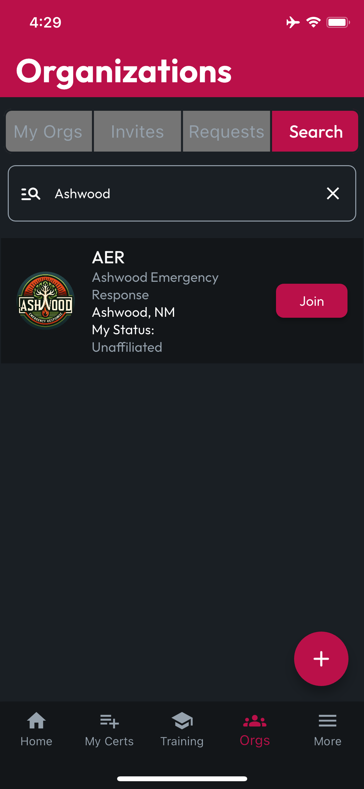
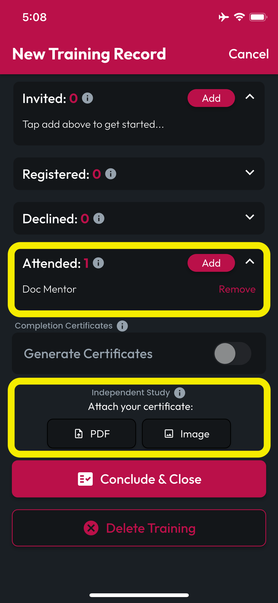
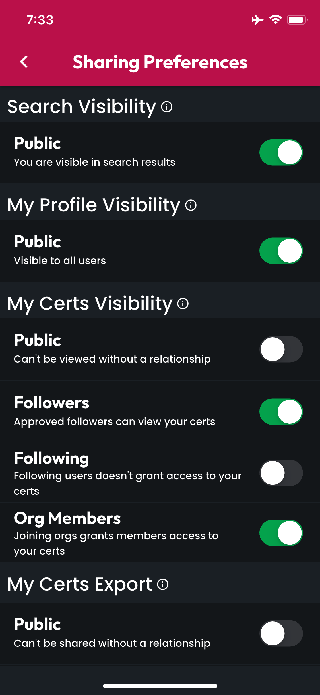

# Tips & Tricks

## Free Tier

### 1. Find Your Friends & Orgs

Navigate to More>Sharing & Followers>Search to find and follow your friends and colleagues in CertLocker, using search terms including their name, contact email/phone, or location.

<figure><figcaption></figcaption></figure> <figure><figcaption></figcaption></figure> <figure><figcaption></figcaption></figure>

You can also find Organizations you belong to, like your employer, the agency where you do gig work, and your volunteer district by going to Orgs>Search.


If you don't find the Org you're looking for, Subscribe at the Officer tier and you can tap the + button (FAB) at the bottom to create a new Org (_if_ you're authorized to do so).


### 2. Access Detailed Renewal Progress

Some Certs have more complex requirements than others (NREMT,  am I right?). CertLocker is ready to help you manage the complexity. Tap the Cert in your locker to load the Edit Cert screen, then tap anywhere on the Renewal Progress bar to open the detailed Renewal Requirements view.

<figure><figcaption></figcaption></figure> <figure><figcaption></figcaption></figure>

### 3. Apply Org & Independent Training to Renewals

Be sure to keep all your training records and certificates of completion in CertLocker, so we can help you track your progress and get all those PDFs at once when it's time to renew. Check out these simple workflows for applying independent study and org trainings to your cert renewal progress:

#### **Create Independent Training Record:** From the Training screen, tap the + button (Fab), then fill in the details of your training. When you reach the Applicable Certs section, tap Add to choose which Cert(s) this training applies to.

<figure><figcaption></figcaption></figure> <figure><figcaption></figcaption></figure> <figure><figcaption></figcaption></figure>

Find and select the appropriate Cert, tap Done, then if the Cert includes Components and Requirements, you can specify which this training applies to.

<figure><figcaption></figcaption></figure> <figure><figcaption></figcaption></figure> <figure><figcaption></figcaption></figure>

Add yourself as the sole user in the Attended list. Finally, if you received a certificate for the training you attended, attach it as a PDF or Image under Independent Study, then tap Conclude & Close.

#### Apply Org Training to Cert Renewal

You can also apply Training you attended to Cert renewals for Training Records created by someone else, as long as they added you to the Attended list. To do this, navigate to Edit Cert>Renewal Requirements screen (as described in item 2 of this article). Tap the requirement where you'd like to apply training and the UI will expand to reveal an Add Training button. Tap it to search for your training.

<figure><figcaption></figcaption></figure> <figure><figcaption></figcaption></figure> <figure><figcaption></figcaption></figure> <figure><figcaption></figcaption></figure>

Search scans any trainings where you're on the Attended list, and will return results matching your text entry to fields like the Title, Description, Location, Trainer's Name, and more. Tap Add on any Training Records that apply to this requirement, and you can even update your search and Add multiple trainings at the same time. Tap Done, and you'll be returned to the Renewal Requirements view to find your progress updated to reflect the CE units earned from the Applied Training.

### 4. Replace & Reset Requirements on Renewal

When you renew a Cert, we recommend you continue to use the same CertLocker record, rather than creating a new one. When you do this, you can access an archive of your certification attachments and all trainings you applied to that round of certification renewal.

<figure><figcaption></figcaption></figure> <figure><figcaption></figcaption></figure> <figure><figcaption></figcaption></figure>

To replace an expired Cert with the renewed one, open the Cert in Edit Cert, then tap "Replace". On the Select Replacement screen, attach a new PDF or image, and enable the Reset Renewal Requirements toggle, if you'd like to reset your Renewal Progress back to zero.

### 5. Set Sharing & Notification Preferences

Navigate to the More navbar item at the bottom to access your Sharing Preferences and Notification Preferences. As a new user, go check whether the CertLocker defaults work for you, and if not, set them to your liking.

<figure><figcaption></figcaption></figure> <figure><figcaption></figcaption></figure>

### 6. Test Notification Methods

To make sure you've configured all the necessary permissions and contact information to receive notifications by every method supported by CertLocker, at the bottom of the Notification Preferences screen, there is a button labeled "Test Delivery Methods," which will attempt to send you test messages via SMS, Email, Push, and In-App Inbox.

<figure><figcaption></figcaption></figure>

When the test completes, you will see results indicating which methods succeeded and which failed. If there was a failure, details will be included to help remedy the issue.

### 7. App Activity Inbox, News & Updates

On your CertLocker Home screen, you can find an Inbox Summary of automated notifications regarding app activities like approaching expirations, training attendance, and org invites, as well as a collection of Recent Updates, which are sent by us at CertLocker to our users with useful information about anything from new features to usage guides, like this one.

<figure><figcaption></figcaption></figure>

To view these messages in their entirety, you can access your Inbox and Updates screens by tapping the View All buttons on your Home screen or from the More navbar item at the bottom of the app.

<figure><figcaption></figcaption></figure> <figure><figcaption></figcaption></figure> <figure><figcaption></figcaption></figure>

### 8. Track Your Usage

Toward the bottom of the More screen, there is a button called Usage & Debugging, which provides information that you may find useful for support requests, like your User ID, and information you can use to determine whether and when you may be approaching your free tier feature limits.

## Responder Tier

### 9. Unlimited Certs in Your Locker

At the Free Tier, your Certs uploads are capped. If you run into these Free Tier limits, upgrade to the Responder Tier to upload all the Certs you've worked hard to earn.

### 10. Unlimited Bulk Shares as PDF/ZIP

You can always export and share your Certs individually, but with Bulk Shares, CertLocker makes it easy to select the Certs you've been requested to supply (perhaps for a new job or new initiative at your current job) and export them, either as a single PDF or collected into a .zip file. At the Free Tier, these Bulk Shares are capped, so if your usage reaches those limits, upgrade to the Responder Tier to get unlimited Bulk Shares.

## Officer Tier

### 11. Create Orgs

If you're an Officer or Administrator at a department or other organization that would like to take advantage of CertLocker's ability to help you keep track of your Members' Certs, you can subscribe at the Officer Tier and gain the superpower of Creating and Managing Orgs in CertLocker.

After you subscribe, navigate to the Orgs navbar item at the bottom, then tap the + icon (or FAB) at the bottom right. Complete the Create Org workflow, and you'll be ready to start inviting members to your new Org.

### 12. Export Other Users' Certs

As an Officer or Administrator, you know you may need to download your Members' Certs from time to time to print them and put them in an official hard-copy filing cabinet, or to validate those Certs, or for any number of compliance reasons. By subscribing at the Officer Tier, you can perform individual or Bulk Share operations of other users' Certs (as long as they've allowed this in their privacy and sharing permissions).


If you're unable to export Certs for a user you've been approved to Follow or who has joined an Org where you're an Officer or Admin, direct them to check their Sharing Preferences on the More screen and ensure they've enabled the necessary permissions to make this feature available.


## Department Tier

### 13. Automatic Onboarding and Consolidated Invoicing for Your Members

At the Department Tier, you don't have to ask your members to subscribe individually, then sort out reimbursement for In-App purchases made by each of your members to get the most out of CertLocker.

Once your Org is onboarded to the Department Tier, you and your Org Admins can manage who is welcomed into the Org in CertLocker, and they'll be granted benefits like Unlimited Certs, Unlimited Bulk Shares, and the ability to utilize Officer/Admin Org Management features (once granted the necessary permissions).

When it comes time for Billing, CertLocker will determine your usage and related costs, then send a single Invoice to a recipient you designate. [Contact a CertLocker representative](mailto:sales@firecal.app) to learn more about this and other reasons to upgrade your Org to a Department contract.

### 14. Generate Training Certificates for Attendees

In addition to a streamlined onboarding and billing process, with a Department contract, your Org gains extra powers, including the ability to Generate Training Certificates for confirmed attendees at any trainings where your Officers or Admins set the contracted Org as the Host.

### 15. Get Reports on Renewal Progress, Training Topics & Gaps

As an Officer or Administrator at the end of the year, do you find yourself wondering and worrying about whether your Members are on-track to complete their renewal requirements on-time? Even better: Wouldn't it be nice to identify the biggest gaps in your Org's renewal requirements well before the deadline approaches, when you're planning the training calendar for the year ahead?

With the Reports add-on, (only available to Orgs contracted at the Department Tier) you can see reports aggregating all your Members' progress toward renewal, broken down by Renewal Components and Requirements.

This way you can recognize that you've covered Medical for most of your members, while Airway hasn't gotten enough attention, then adjust your training topics accordingly.

