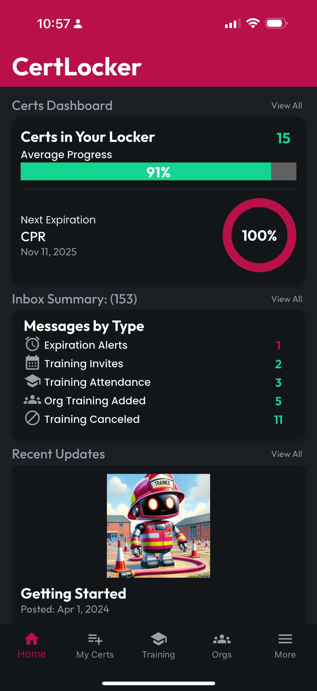

# Home Tour

Your CertLocker homescreen is made up of three sections: Certs Dashboard, Inbox Summary, and Recent Updates.

<figure><figcaption></figcaption></figure>

## Certs Dashboard

The Certs Dashboard provides an overview of how many Certs you have in your Locker and your Average Renewal Progress for those Certs. You'll also see a reminder of your next Next Expiration, with the date of expiration and your renewal progress for that Cert. Tap View All to go to your My Certs screen, or simply tap My Certs in the navbar at the bottom.

## Inbox Summary

Your CertLocker Inbox consists of system generated notifications about activity relating to your account. These messages include account activity like Approaching Cert Expirations, Training and Org Invitations, and more. On your Homescreen, the Inbox Summary gives you a count of messages of various types. Tap "View All" to be routed to your Inbox, where you can read, archive, and delete these notifications, or you can reach your Inbox by navigating to More>Inbox.

## Recent Updates

Updates are messages created for CertLocker users by the CertLocker team to provide information about the app, particularly changes we're making. On your Homescreen, you'll find the most recent Updates. You can access all your Updates by tapping View All from the Homescreen, or navigate to More>News & Updates.
