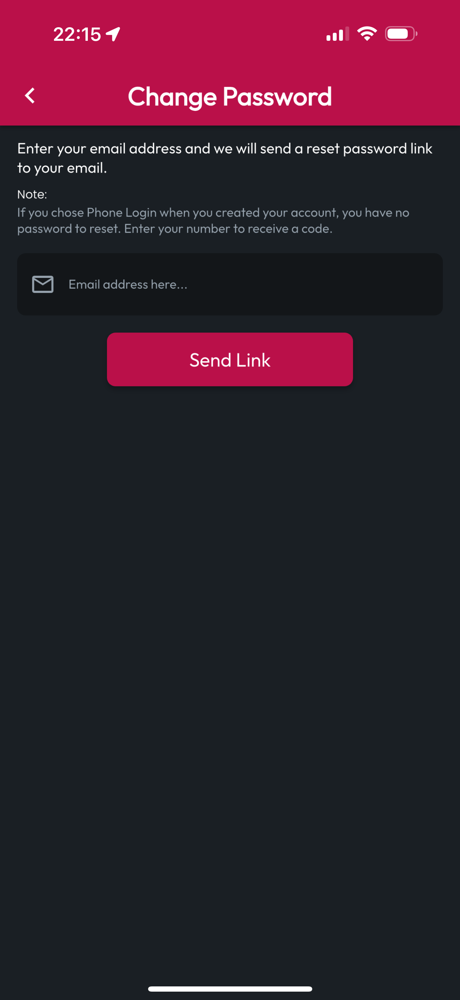

# Change Password

If you would like to change your password, whether you forgot it (but are still logged in) or just want to make it more challenging and secure, navigate to More, then tap Change Password. Enter the email address you used to register your account, then tap Send Link.

You'll receive an email with instructions to change your password.


If you've forgotten your password and need help resetting it, reach out to support@certlocker.app, and we'll help you regain access to your account.


<figure><figcaption></figcaption></figure>
