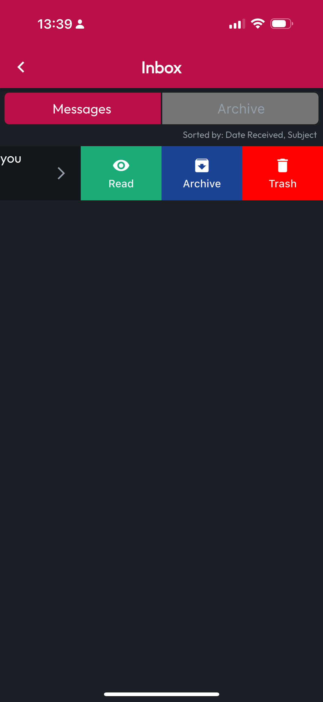

# Inbox

Messages in your Inbox include account activity like Approaching Cert Expirations, Training and Org Invitations, and more. Tap on a Message to open. You can also mark as Read, Archive, and Trash a Message by swiping to reveal these options. To find Archived messages, tap the Archive tab at the top.

<figure><figcaption></figcaption></figure> <figure><figcaption></figcaption></figure> <figure><figcaption></figcaption></figure>

