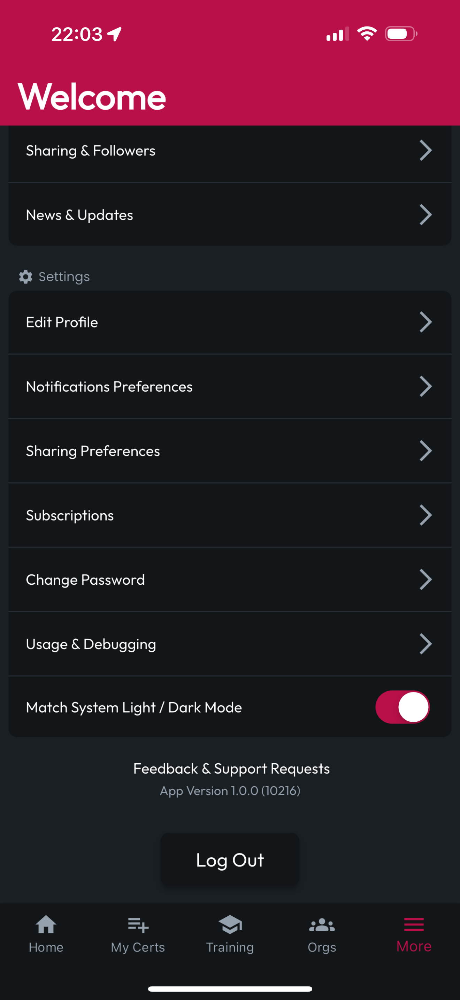
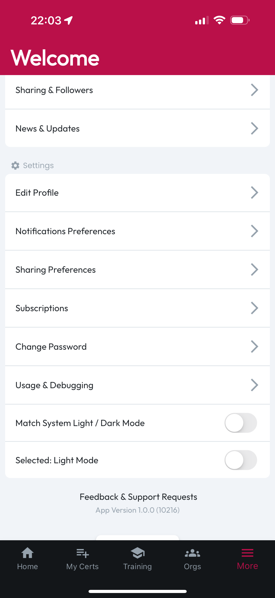

# Light/Dark Mode

At the bottom of the Settings section of the More tab, you can opt to have CertLocker's light/dark mode match your system setting. So if your phone is always in light mode, CertLocker will be too. Or if your phone changes between light/dark mode based on the time of day, CertLocker will follow your system's lead.

If you would rather lock CertLocker into one mode, regardless of what else is going on with your device, toggle off Match System Light / Dark Mode, and an additional toggle will appear, allowing you to switch between light and dark mode. Whatever you choose, your preference will be retained until you change it.

<figure><figcaption></figcaption></figure> <figure><figcaption></figcaption></figure> <figure><figcaption></figcaption></figure>

