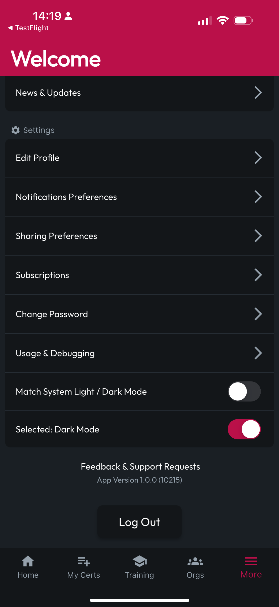

# More Options

## Tap More at the Bottom

Tapping on the More navbar item at the bottom of the screen will bring you to the More Screen, which provides several options worth exploring. Here, we'll introduce what each of these options can do, and you can find more details for each later in the docs.

<figure><figcaption></figcaption></figure> <figure><figcaption></figcaption></figure>

## Inbox & Sharing

### Inbox

### Sharing & Followers

### Sharing Preferences

### Notification Preferences

### News & Updates

## Settings

### Edit Profile

### Subscriptions

### Change Password

### Usage & Debugging

### Light/Dark Mode

