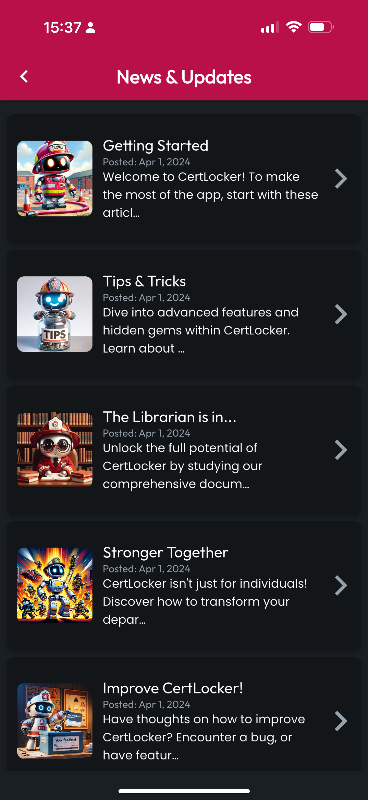
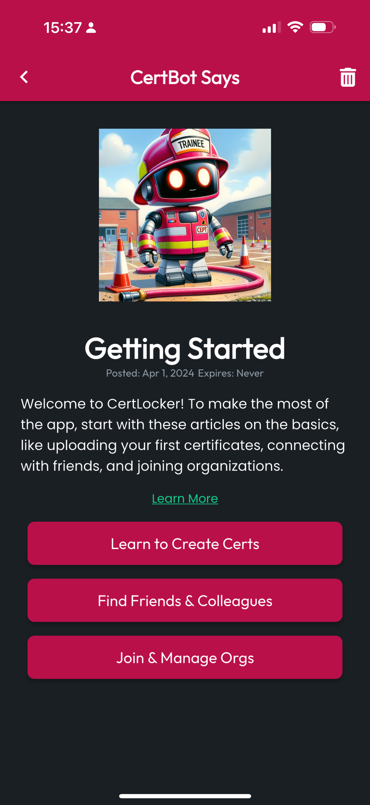
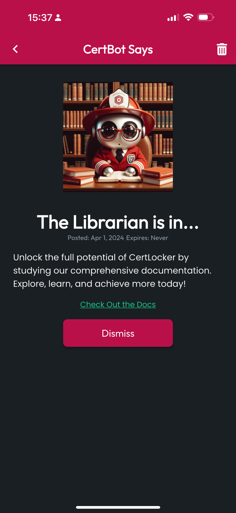

# News & Updates

To reach News & Updates, tap More in the navbar, then tap News & Updates. Here you'll see a list of Updates you haven't dismissed yet.

<figure><figcaption></figcaption></figure> <figure><figcaption></figcaption></figure>

## Interacting with Updates

All Updates will display a Trashcan icon in the top-right, which will remove them from your list. Some Updates may have a Dismiss button, which will acknowledge you've received the Update and remove it from the list. Other Updates may have multiple buttons which can direct you to resources or provide feedback to CertLocker on simple questions.

<figure><figcaption></figcaption></figure> <figure><figcaption></figcaption></figure>

