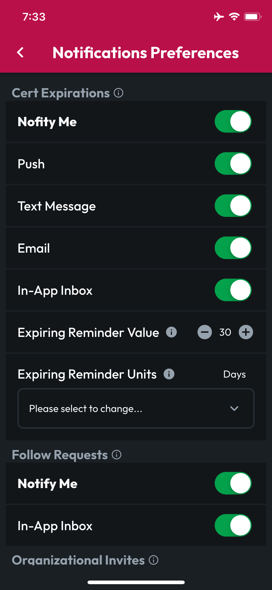

# Notification Preferences

Tap More in the navbar at the bottom, then tap Notification Preferences.

When a preference is set to Notify Me, granular positions will become available. If you disable Notify Me, granular options will become unavailable, as all notifications for that type of event will be disabled.


Granular notifications preferences are retained, even if you disable Notify Me for a type of app event, so if you change your mind later and enable Notify Me, your previous preferences for that section will be restored.


For your Cert Expirations, if you keep Notify Me enabled, you can select among several delivery methods, and you can set the default Expiring Reminder Timeframe, which indicates how long before expiration you would like CertLocker to remind you about the approaching renewal deadline. Changes here will be applied to new Certs when you create them.


**Important:** Updating the Expiration Reminder Timeframe will not change the existing timeframe for any Certs you've already created.

Each Cert retains its own expiration timeframe to maximize your flexibility on reminders for Certs with various renewal periods and requirements, so this preference will only set the default for new Cert uploads. If you'd like to update the timeframe for existing Certs, you'll need to make changes on each Cert individually.


<figure><figcaption></figcaption></figure> <figure><figcaption></figcaption></figure>

For most event types, currently the only delivery method is via the In-App Inbox. We're working to update this quickly and add Push, Text Message, and Email for all event types.
