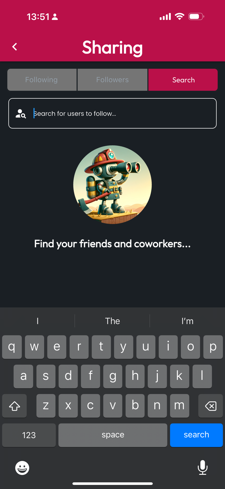

# Find Users to Follow

## Navigate to the Sharing Tab

Select the **More** tab at the bottom of the application, then tap **Sharing & Followers** to see options for **Following**, **Followers**, and **Search**. To find **Users** to **Follow**, select **Search**.

<figure><figcaption></figcaption></figure> <figure><figcaption></figcaption></figure>

## Enter Search Terms & Follow

Search terms can be broad, including details like another user's **Name**, **City**, **State**, **Email Address**, and **Phone Number**. When you've found the **User** you'd like to **Follow**, simply tap the **Follow** button, and they'll be sent a **Follow Request** for **Approval**.

<figure><figcaption></figcaption></figure>

## Your Following List

While your **Follow Request** is **Pending**, you'll be able to see your new **Follow** on the **Following Tab**, and you can navigate to their **Profile** to see more information, including **Organization Memberships**. Users can set their **Sharing Preferences**, so depending on their **Settings**, you may not be able to **View** and **Share** this user's **Certs**.

<figure><figcaption></figcaption></figure>
