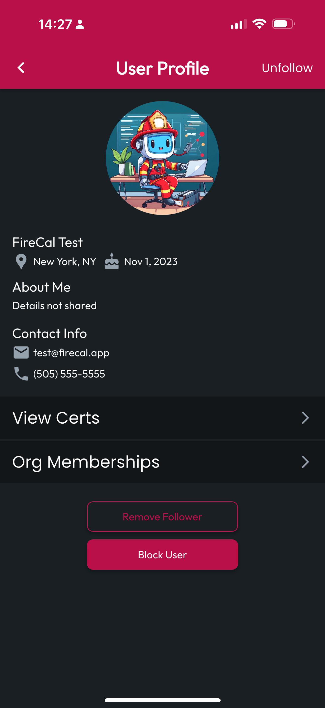

# Manage Followers List

## Open the Sharing Tab

Select the **More** tab at the bottom of the application, then tap **Sharing & Followers.** The default tab loaded is **Following**, so tap **Followers.** From here you can navigate to **User Profiles** by tapping on the **List Item** for a given **User**.

<figure><figcaption></figcaption></figure> <figure><figcaption></figcaption></figure>

## Approve or Deny Followers

From the Followers List, Follow Requests can be Approved or Denied. Approving a Follow allows the Follower to access your Profile and Certs according to your Sharing Preferences. Denying a Follower will remove them from your Followers List and remove you from their Following List.


**Important**: If your Sharing Preferences for your My Certs page are set to Public, any Certs you haven't marked Private will still be viewable.


## Remove Followers

To remove a Follower you've already approved, simple tap Remove from the Followers list, or you can tap their list item to navigate to their profile, then scroll to the bottom to tap Remove Follower, or Block to prevent them from trying to follow you again in the future.

<figure><figcaption></figcaption></figure>
