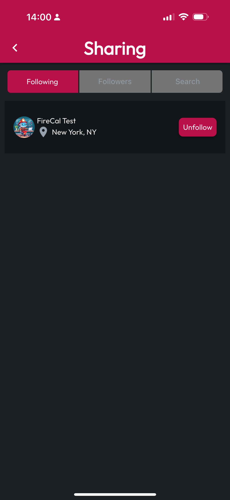

# Manage Following List

## Navigate to the Sharing Tab

Select the **More** tab at the bottom of the application, then tap **Sharing & Followers.** The default tab loaded is **Following**, which allows navigation to **User Profiles** by tapping on the **List Item** for a given **User**. To **Unfollow** a user in the list, simply **tap** the **Unfollow** button, and they will be removed from the **Following List**.

<figure><figcaption></figcaption></figure>
