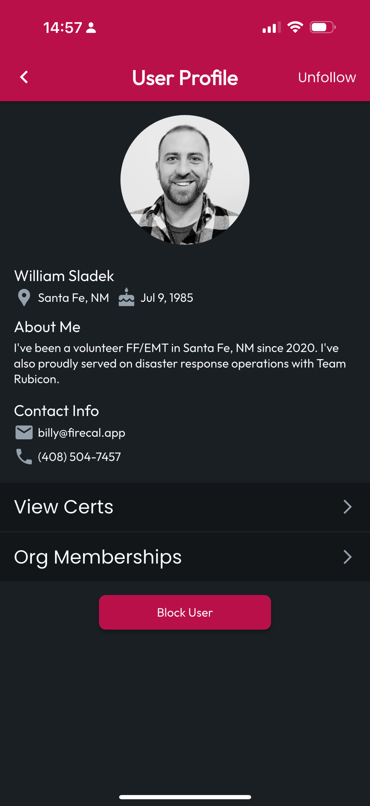
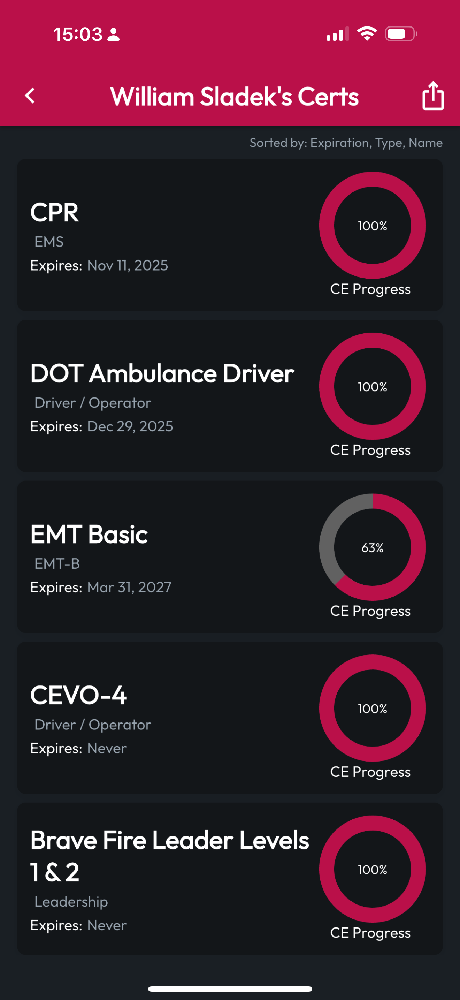
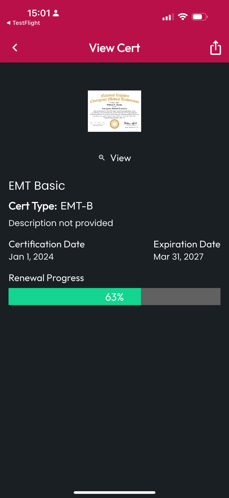
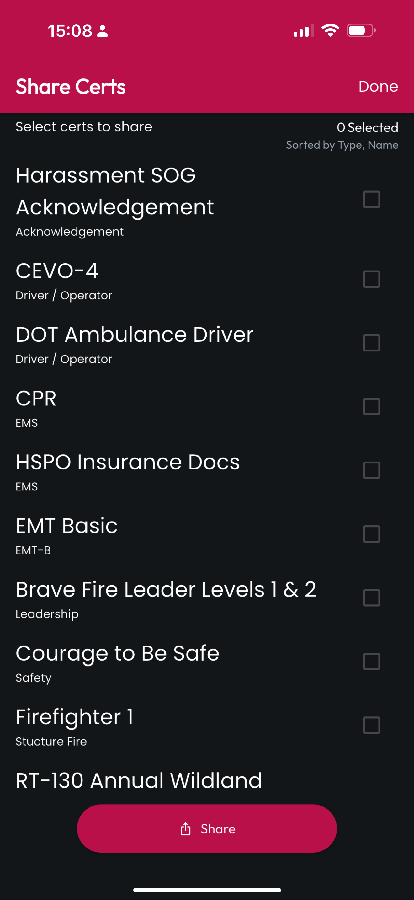

# Viewing & Sharing User Certs

## From the User Profile

To reach the **User Profile**, follow the instructions for [Viewing User Profiles](viewing-user-profiles.md). From the **User Profile**, tap the button "**View Certs**" to view their list of **Certs**.


**Important:** Access to view the **User Certs** page and individual **Certs** may be limited by the **User**, depending on their **Sharing Preferences**. If expected **Certs** are not displayed for a known **User**, contact them to adjust their **Sharing Preferences**.


<figure><figcaption></figcaption></figure> <figure><figcaption></figcaption></figure>

## View a Cert

Tap any **Cert** in the **User Certs List** to view the **Cert Details**, load the Cert as a PDF, and even Export the Cert as PDF.

<figure><figcaption></figcaption></figure>

## Select & Share Multiple Certs

Based on User Sharing Preferences, the **Certs** displayed may also be **Shared** from the **User Certs** view as a **Combined PDF**. To do this, tap the **Share** icon in the top right corner and a multi-select list of shareable Certs will appear. Select the Certs for export, then tap **Share** and the **Combined PDF** will open in a web browser, where you can save the file as you'd like.

<figure><figcaption></figcaption></figure> <figure><figcaption></figcaption></figure>

