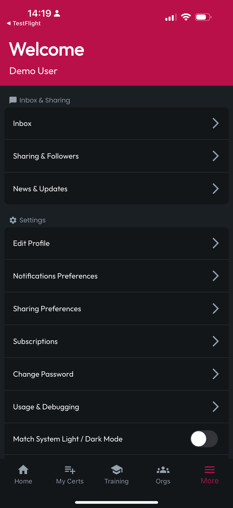

# Sharing Preferences

Navigate to the More navbar item at the bottom, then tap **Sharing Preferences**. When a preference is set to Public, granular positions will become unavailable, as Public this preference is open to all users. When Public is disabled, you can specify which relationships with other Users will gain them access to view your Profile and Certs, or to Export your Certs.

<figure><figcaption></figcaption></figure> <figure><figcaption></figcaption></figure>

## Blocked Users

At the bottom, you can also see a list of Blocked Users. If you would like to Unblock any users on the list, you can Swipe on their list item to reveal an Unblock button. Tap it, and they will be Unblocked.

<figure><figcaption></figcaption></figure> <figure><figcaption></figcaption></figure> <figure><figcaption></figcaption></figure>

