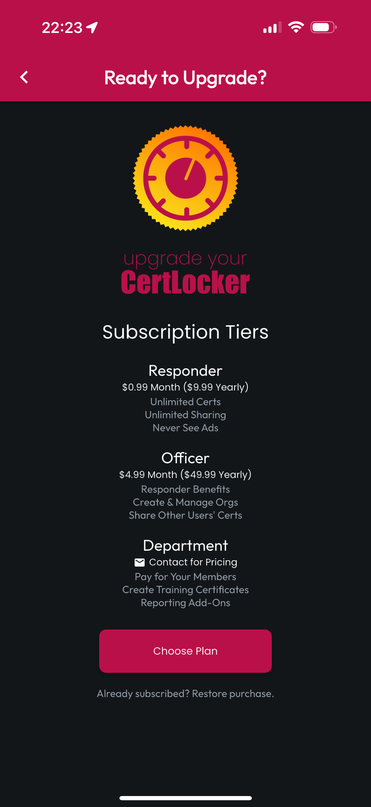
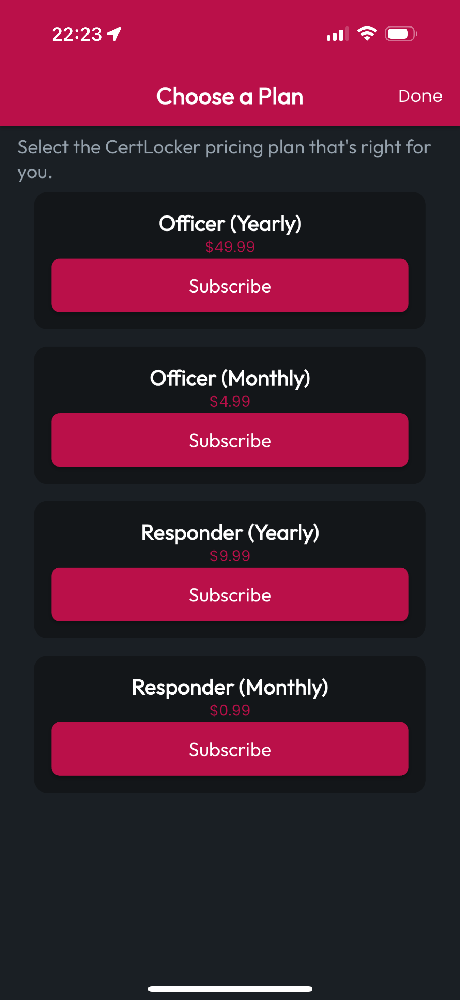
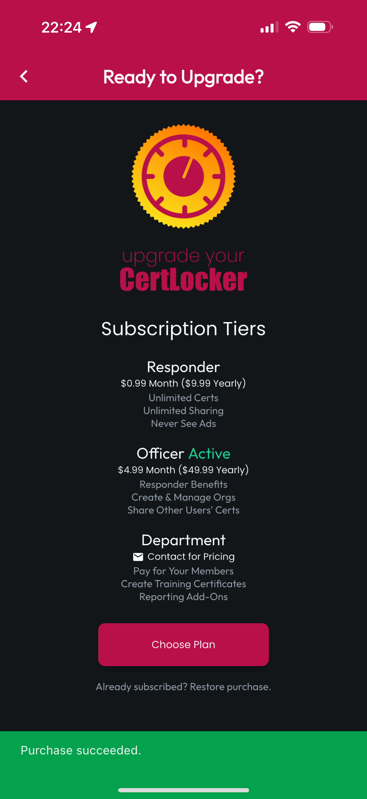

# Subscriptions

When you're ready to get more out of CertLocker, navigate to More, then tap Subscriptions. Consider your needs, and tap Choose Plan to select the best fit for you. Tab the Subscribe button that accompanies the tier and duration you've chosen, then complete the purchase flow on your device platform to complete the Subscription via In-App Purchase.

If you're looking for the most advances Org features, like Training Certificate Generation, Reporting, and Sponsored Subscriptions for all your Org's members - all with automated invoicing, contact us at sales@firecal.app, and we'll get you setup.

<figure><figcaption></figcaption></figure> <figure><figcaption></figcaption></figure> <figure><figcaption></figcaption></figure>

