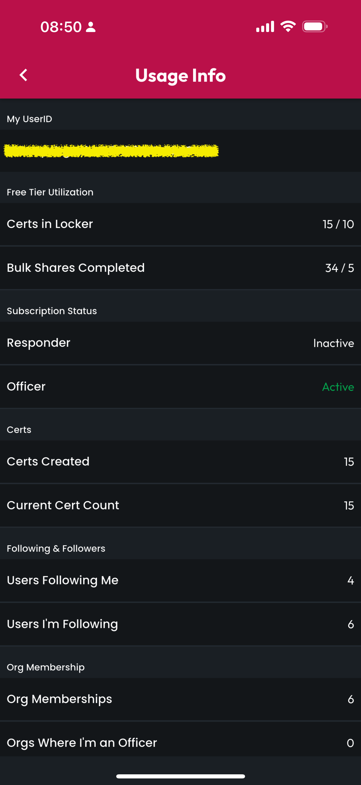

# Usage & Debugging

Toward the bottom of the More screen, there is a button called Usage & Debugging, which provides information that you may find useful for support requests, like your User ID, and information you can use to determine whether and when you may be approaching your free tier feature limits.

<figure><figcaption></figcaption></figure>
