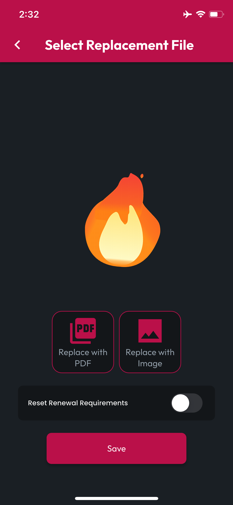
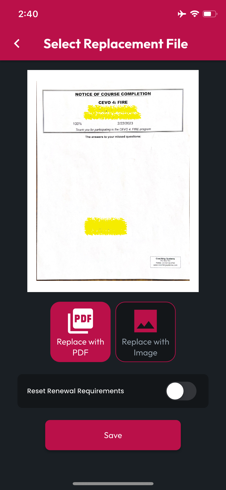
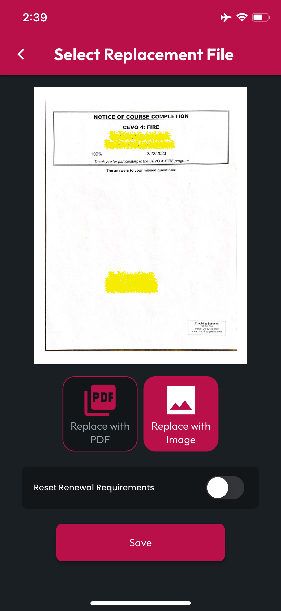

# Replacing Attachments

## Tap to Open

When looking at your Locker, **Tap a Cert** to open the **Edit Cert** page, then below the **Thumbnail**, tap the **Replace** button to navigate to the **Select Replacement** UI. When you Replace an attachment, the previous version is archived, along with the state and details of your Renewal Progress at the time of replacement.

<figure><figcaption></figcaption></figure> <figure><figcaption></figcaption></figure>

## Replace with PDF

To replace the digital version or image of your Cert with a PDF, tap **Replace with PDF**. You'll be presented with your device's file picker, and you can navigate to your digital copy of this cert.

CertLocker will display the replacement in the **PDF Viewer** when the upload is complete and processed.

## Replace with Image

To replace the digital version or image of your Cert with an image, tap **Replace Image**. You'll be asked whether you'd like to select from your device's **Gallery** or use the **Camera** to create an image of your paper Cert. Select your image or take a photo of your Cert.

CertLocker will display the replacement in the **PDF Viewer** when the upload is complete and processed.


**NOTE**: Image attachments will be saved in the cloud and a PDF will be created for compatibility among all your Certs throughout the app.


<figure><figcaption></figcaption></figure> <figure><figcaption></figcaption></figure>

## Reset Renewal Requirements

If you're Replacing your Cert attachment with a recently Renewed document, turn on the toggle labeled **Reset Renewal Requirements** to zero out all your logged progress and applied training. When you do this, CertLocker will archive the previous attachment along with your Applied Training and all Manually Added Renewal Progress at the time of replacement.
