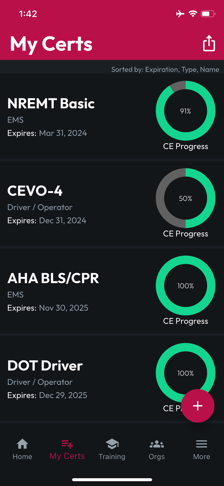
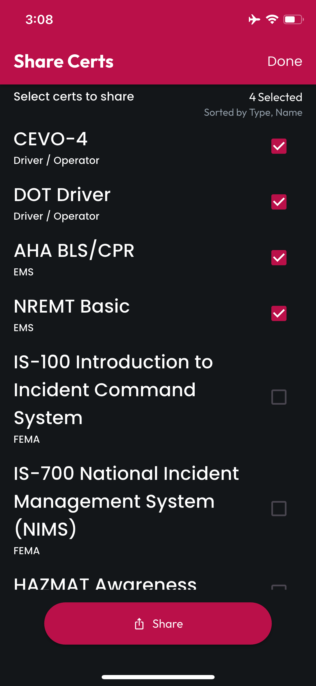

# Share Multiple Certs

## Start in Your Locker

While viewing your Locker, tap the Share Icon in the top right corner of the screen. You'll be taken to the Share Certs screen.

Tap the **Multiselect Checkboxes** beside the Certs you'd like to share, and you'll see the **Selected Counter** increase with each selection.

<figure><figcaption></figcaption></figure> <figure><figcaption></figcaption></figure>

Tap **Share** at the bottom of the screen, and CertLocker will create a **Combined PDF** of all the Certs you selected.

Your Combined PDF will be opened in your platform's browser, and from there you can share or download to any location of your choosing.
