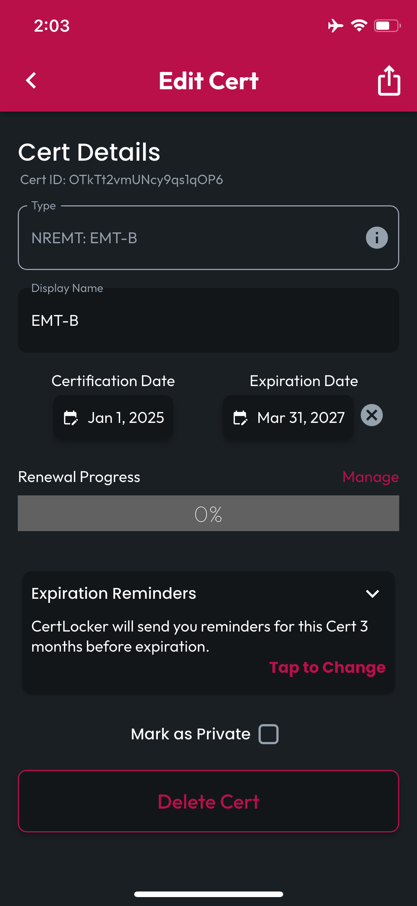
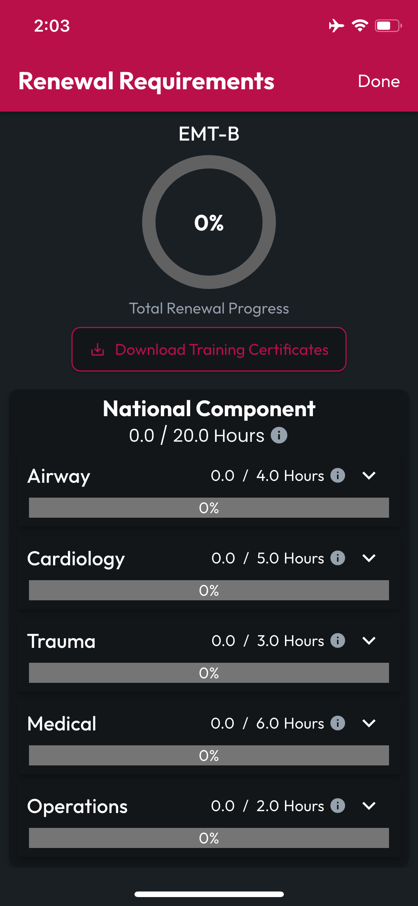
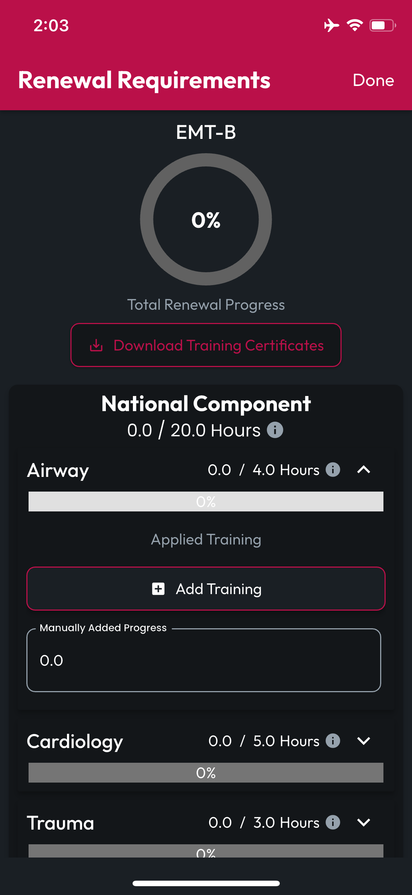
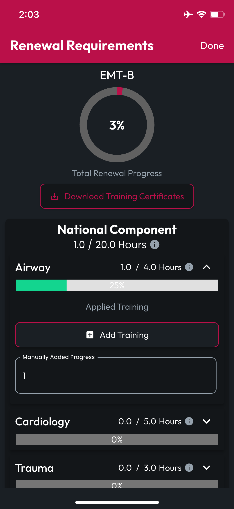
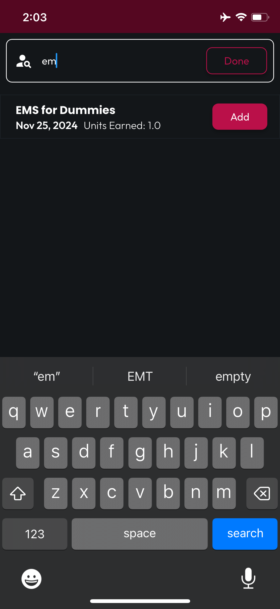
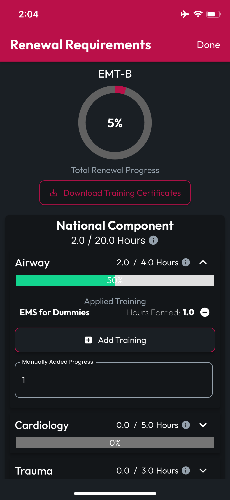
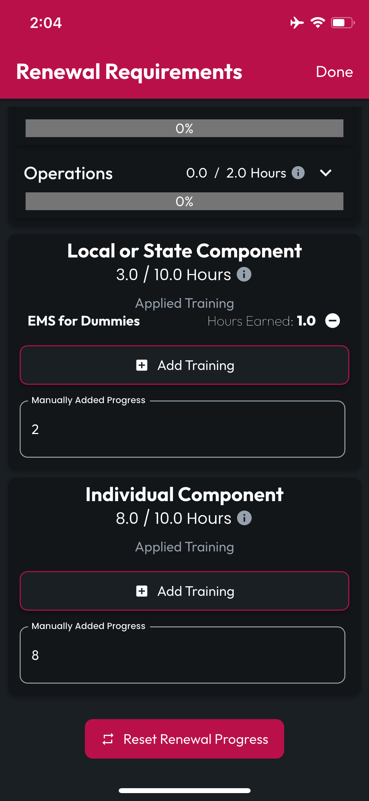
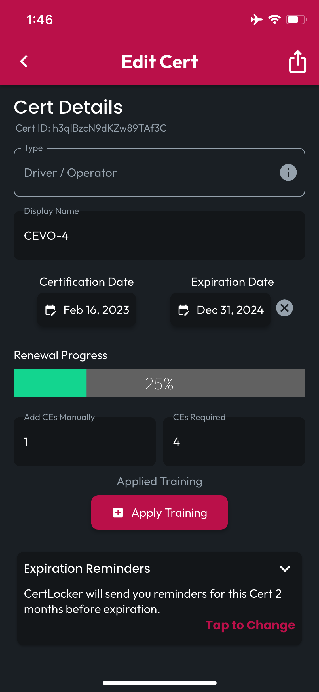
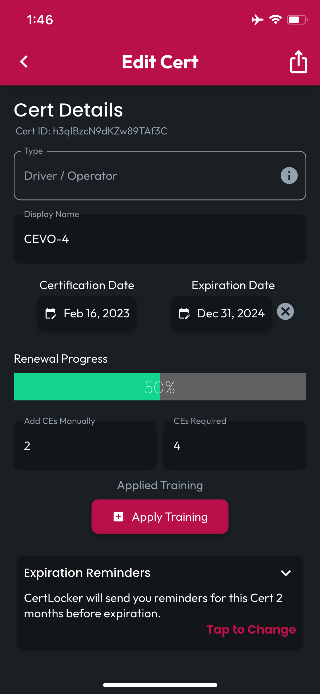
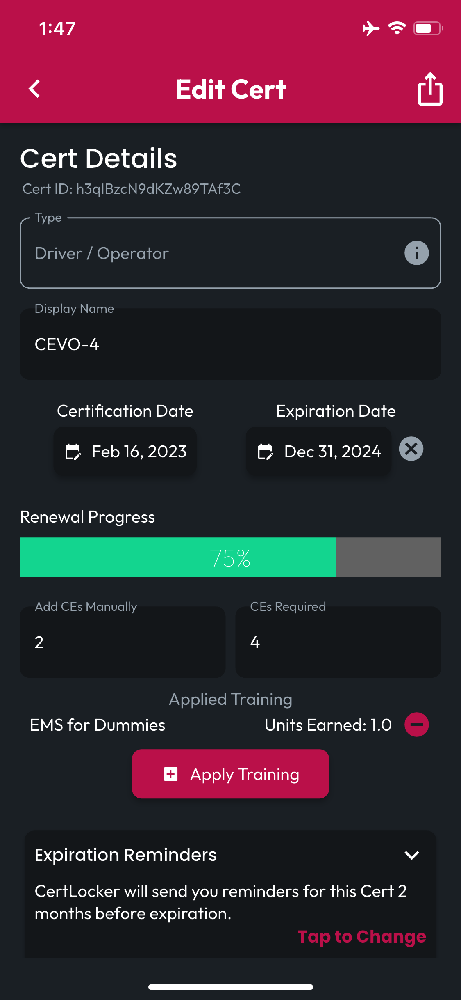

# Tracking CE Progress

## View in Locker

You can see the recorded **CE Progress** for all your Certs with a glance in your **Locker**. From there, **Tap a Cert** to open the **Edit Cert** page.

<figure><figcaption></figcaption></figure>

## Certs with Renewal Requirements

Certs with Renewal Requirements will show a Manage button above the Renewal Progress bar. Tap that button to access your Renewal Requirements.

<figure><figcaption></figcaption></figure> <figure><figcaption></figcaption></figure>

#### Manually Add Progress

To update Requirements progress for an individual Requirement, expand the Requirements Card to either update the Manually Added Progress, seeing your changes reflected immediately in that Requirement's progress bar and the Cert's Renewal Requirements progress indicator at the top.

<figure><figcaption></figcaption></figure> <figure><figcaption></figcaption></figure>

#### Apply Training

To Apply Training you've already logged in CertLocker, Tap Add Training, and you'll be presented with a search field. When you find the training you'd like to apply, tap Add. Find and add as many trainings as you'd like, then tap Done, and you'll see the changes reflected in the Requirement's progress bar and the Cert's progress indicator at the top.

<figure><figcaption></figcaption></figure> <figure><figcaption></figcaption></figure>

#### Components Progress: Manually Add & Apply Training

You can log progress by the same two methods at the Component level. Components don't display their own progress bar, but you will see your changes reflected in the fraction displayed at the top of the Component Card.

<figure><figcaption></figcaption></figure>

## Certs without Renewal Requirements

### Modify CE Fields

The **CEs Earned** and **CEs Required** fields will autosave if you make changes, and as they do, you'll see the **Recertification Progress** bar recalculate and update to reflect CEs you've earned or changes to the requirements.

<figure><figcaption></figcaption></figure> <figure><figcaption></figcaption></figure>

### Apply Training

You can also find and apply Training you've completed and logged in CertLocker using the Apply Training button. When you tap it, you'll be presented with a search field that will find Trainings you've attended, based on you search terms.

<figure><figcaption></figcaption></figure> <figure><figcaption></figcaption></figure>

Simply tap **Add** to apply, and you can even update your search terms to find and Add multiple Training Records to this Cert. Tap **Done** when you've added all the Trainings you'd like to apply and you'll see your Renewal Progress updated to reflect your changes.

