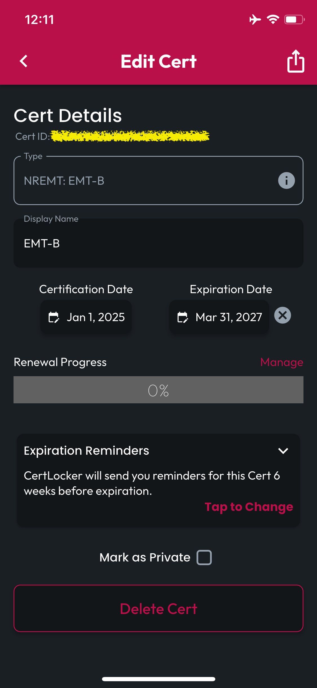
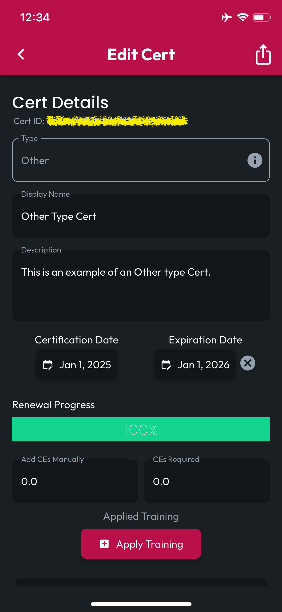

# Updating Cert Data

## Tap to Open

When looking at your Locker, **Tap a Cert** to open the **Edit Cert** screen.

## Update Text Fields

At the moment, CertLocker does not support changing the **Type** of a Cert once create&#x64;**.**&#x20;

For Certs of the type "Other," you can update the **Name, Description**, **CEs Earned**, and **CEs Required** fields, and your changes will be autosaved. For these Certs, you can also use the Apply Training button to assign CEs earned in trainings logged in CertLocker to this Cert.


For Certs with defined **Renewal Requirements**, the CEs Earned & Required fields do not appear, nor does the Apply Training button. Instead, Cert Renewal Progress details are accessed and managed by tapping on the Recertification Progress bar.


<figure><figcaption>
Cert with defined requirements (eg. EMT-B)
</figcaption></figure> <figure><figcaption>
Cert without defined requirements (eg. Other)
</figcaption></figure>

## Update Date Fields

Tap on **Certification Date** or **Expiration Date** to call up a date picker and make changes. When you confirm your changes, they'll be saved to the database. To change the **Expiration Date** to Never, tap the **Cancel Icon,** and the change to Never will be saved.

## Update Expiration Reminders

To change when you'll be reminded about approaching Expiration Dates, tap the Expiration Reminders expandable card to reveal the UI for setting a value and unit.&#x20;

## Mark as Private

To change the privacy setting for this Cert, simply check or uncheck the Mark as Private checkbox.

