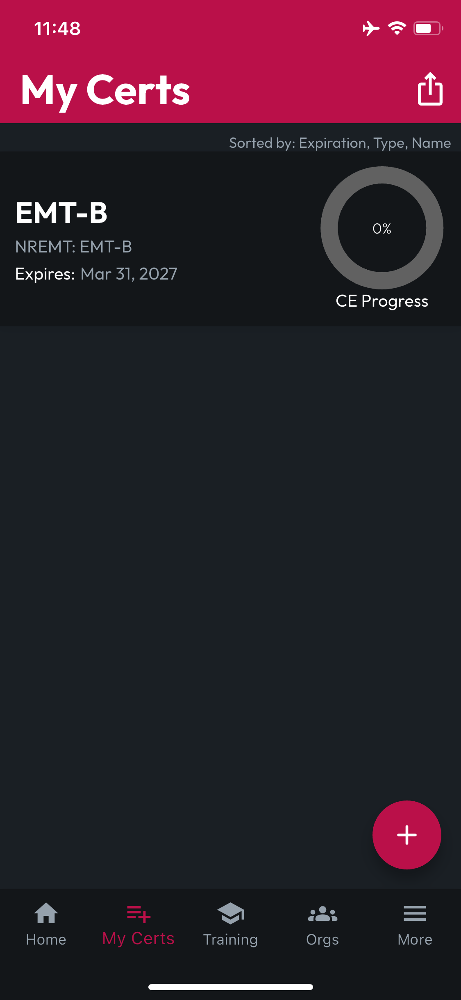

# Uploading Certs

## The First Cert

When you first access your empty Locker, you'll meet CertBot and see a button to **Upload 1st Cert**. To start your Cert collection, you can tap **Upload 1st Cert**, or use the **Floating Action Button (FAB)**, which is the red circle and "+" sign at the bottom right.

Before you can upload a Cert, you'll be prompted to review and accept the CertLocker Terms of Service by tapping "**Got it. I'm in."** You can find the complete Terms of Service via a link on the Terms of Service screen, which will bring you to the appropriate page in these docs. Once you accept the Terms of Service, we will record your acknowledgement and direct you to the **Create Cert** screen.

<figure><figcaption></figcaption></figure> <figure><figcaption></figcaption></figure>

If you're having second thoughts about CertLocker or don't agree with the Terms of Service, tapping "**Sorry. I'm out."** will log you out, and then we'd appreciate [any helpful input you can offer](https://form.asana.com/?d=1107920631423484\&k=QipQafA-VqMyE4VOj0FjYA) on why CertLocker wasn't for you. If you change your mind later, simply login with the account you registered, follow the same steps above, but this time, tap "**Got it. I'm in."**

After you've accepted the Terms of Service, the + (FAB) will route you directly to the Create Cert screen from then-on.

## Enter Cert Data

Find the correct **Type**, which should reflect issuing agency and level of certification for your Cert, eg. **Type**: _NREMT: EMT-B_ would be the Type to choose for an EMT Basic Cert. We're updating our catalog of supported Cert Types all the time, but if CertLocker doesn't yet include a record of the Cert Type you're uploading, choose **Other**.

Give your Cert a **Name,** which will be displayed on your My Certs list.

Pick the **Certification Date** when you earned this Cert, then pick the **Expiration Date**. If this Cert never expires, don't select any value, or if you did by mistake, you can tap the circled "X" to reset your **Expiration Date** to **Never**.

<figure><figcaption></figcaption></figure>

The Expiration Reminders section will display the default reminder schedule. If you would like CertLocker to remind you about this Cert's expiration at a different interval, tap the Expiration Reminders expandable card, then set the value and units you'd like to use and tap **Set Custom Reminder**.

<figure><figcaption></figcaption></figure>

Finally, to attach a digital version or image of your Cert, tap **PDF** or **Image**. For PDFs, you'll be presented with your device's file picker, and you can navigate to your digital copy of this cert. For images, you'll be asked whether you'd like to select from your device's **Gallery** or use the **Camera** to create an image of your paper Cert. Select your image or take a photo of your Cert.

CertLocker will display an **Uploading** message at the bottom and a **Success** message when it is done. When you're finished, tap **Create**.


**NOTE**: Image attachments will be saved in the cloud and a PDF will be created for compatibility among all your Certs throughout the app.


If any **Required Fields** are missing, or if a valid **Attachment** hasn't been added, CertLocker will prompt you to remedy the issue. If nothing is missing, your Cert will be created, and you'll be routed back to your Locker, where you'll see your **First Cert**!

<figure><figcaption></figcaption></figure>

## Adding More Certs

After you've added your First Cert, add more Certs using the **FAB** (red circle with "+") at the bottom right of your **Locker,** following the same steps above. In the CertLocker BETA, your Locker defaults to sorting by **Expiration Date**, **Type**, and then **Name**.
