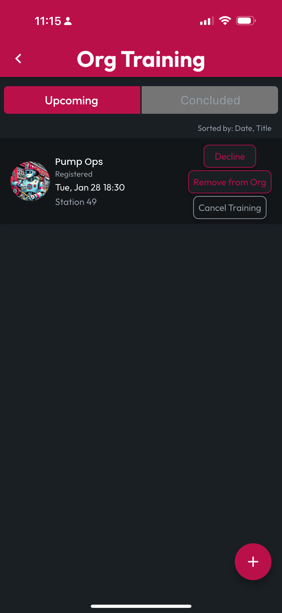

# Browse Org Trainings

As a Member of an Org, you can browse Upcoming and Concluded Trainings where that Org is listed as Participating. Go to the Orgs navbar item at the bottom, then tap the Org whose Trainings you'd like to browse.

On the Org Profile, you'll see Upcoming Training listed, along with your Status. Tap an individual training to View, or tap View All to navigate to the Org Training screen, where you can see all Upcoming and Concluded Trainings and manage your Registration status.


As an Org Admin, you can opt your Org out of any training by tapping Remove from Org. If you created any of the Trainings listed, you can also Cancel Training, deleting the Training Record and removing it from all engaged Users', including deleting Generated Certificates.


<figure><figcaption></figcaption></figure> <figure><figcaption></figcaption></figure>

