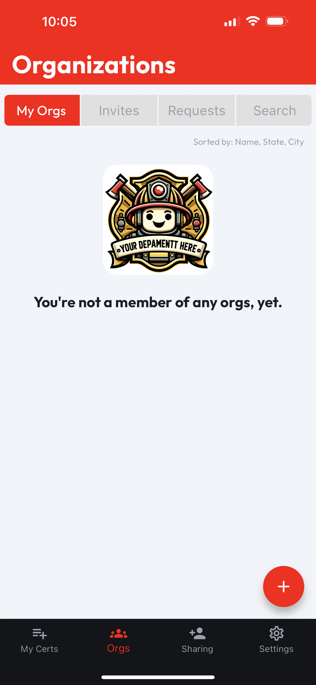
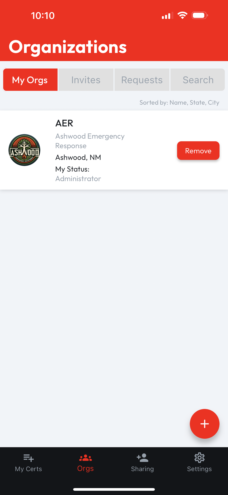
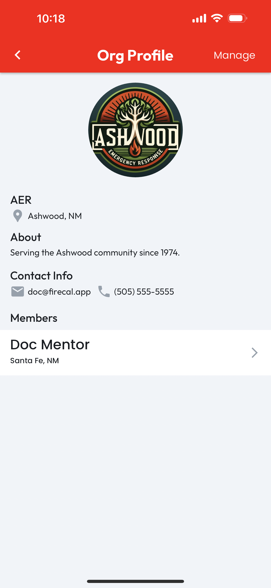

# My Orgs

## Browsing Organizations

To explore the organizations you're part of, open the **Orgs** tab and select **My Orgs**. If you haven't joined any organizations yet, you'll see an empty list image, like below.

<figure><figcaption></figcaption></figure>

After you've joined any organizations, you'll see a list, along with basic details, such as the org's name, location, and your current status within it.

<figure><figcaption></figcaption></figure>

### Understanding Your Status

Your status with each organization might be one of the following:

* **Invited**: You've been invited to join this organization but haven't accepted yet.
* **Requested**: You requested to join the organization and are awaiting admin approval.
* **Member**: Congratulations, you're a part of this organization.
* **Officer**: You've been promoted to an officer within the organization.
* **Administrator**: You have permissions to manage the organization's profile, handle invites, and approve requests.

To view more info about any organization, tap the **Org Card**, and you'll be taken to the **Org Profile**.

<figure><figcaption></figcaption></figure>

## Removing Organizations

To **remove** yourself from an organization, simply tap the **Remove** button next to the relevant org.

<figure><figcaption></figcaption></figure>
