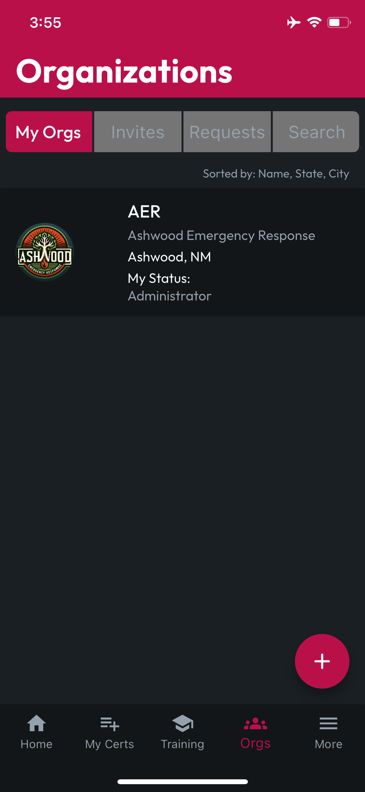
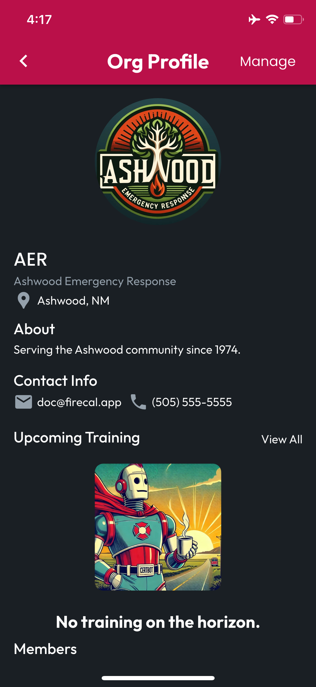
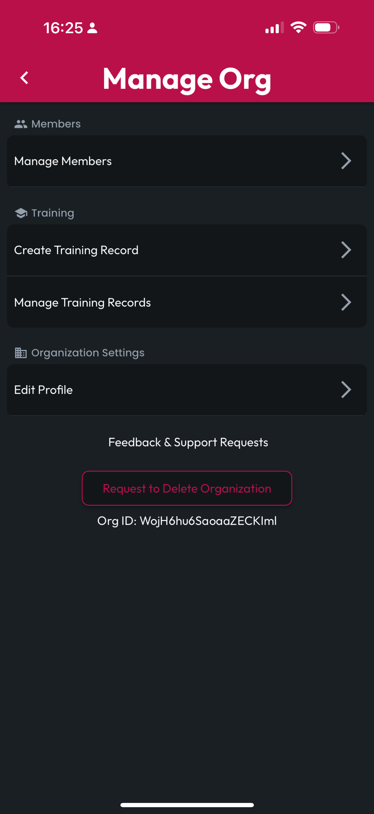
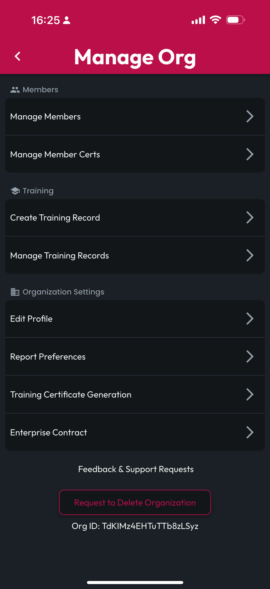

# Org Administration

## Accessing Administration Features

Managing an organization requires the **Admin** role. To verify your role, tap **Orgs** on the CertLocker navbar, then for the organization of interest, look at **My Status**, which will be listed as **Administrator** for all users with that role.

<figure><figcaption></figcaption></figure>

If **Administrator** is listed, tap the **Org Card** to navigate to the **Org Profile** page.

When viewing an **Org Profile**, if you are an administrator, a **Manage** button will be visible in the top right corner of the organization's profile page. Tap this button to proceed to the Manage Org screen, whose features will vary based on your Org's contract. These features will be detailed on the following pages.

<figure><figcaption>
Tap the Manage button
</figcaption></figure> <figure><figcaption>
Manage options without contract
</figcaption></figure> <figure><figcaption>
Manage options with contract
</figcaption></figure>

