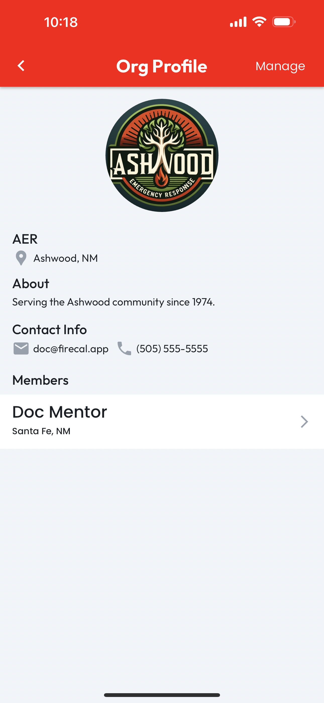

# Org Administration

## Accessing Administration Features

Managing an organization requires the **Admin** role. To verify your role, tap **Orgs** on the CertLocker navbar, then for the organization of interest, look at **My Status**, which will be listed as **Administrator** for all users with that role.

<figure><figcaption></figcaption></figure>

If **Administrator** is listed, tap the **Org Card** to navigate to the **Org Profile** page. Alternatively, access the **Search** tab under the **Orgs** navbar item and enter the org name to find your organization.

<figure><figcaption></figcaption></figure>

When viewing an **Org Profile**, if you are an administrator, a **Manage** button will be visible in the top right corner of the organization's profile page. Tap this button to proceed to the administration features, detailed on the following pages.

<figure><figcaption></figcaption></figure>
