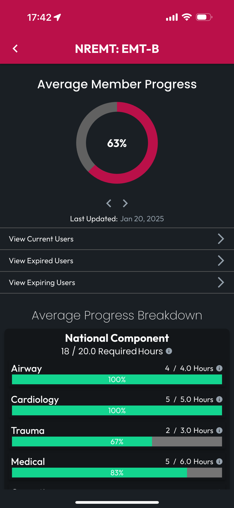
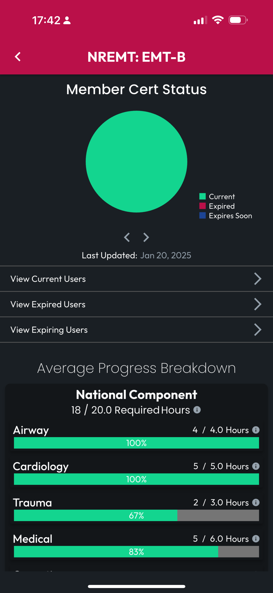

# Manage Member Certs

Manage Member Certs, found on the Manage Org screen, provides access to reports on Renewal Progress for all the Certs in possession of member throughout the Org.

The Member Certs screen lists the Certs with reports, including information such as Avg Progress and counts of Members with the Cert, including a breakdown between those who are Current, Expired, and Expiring (based on the the values set on the Report Preferences screen).

Tap any Cert to see the full report details.

<figure><figcaption></figcaption></figure> <figure><figcaption></figcaption></figure>

At the top of the report screen for a given Cert, you can browse between an Average Member Progress chard, and a pie chart showing the breakdown of Member Cert Status.

Below these charts, you can access a list of Members with each Cert Status.

Finally, for Certs that include detailed Renewal Requirements, browse Average Progress of your entire Org on each of those Requirements, allowing you to identify training opportunities to advance your Org Members toward renewal.

<figure><figcaption></figcaption></figure> <figure><figcaption></figcaption></figure>

