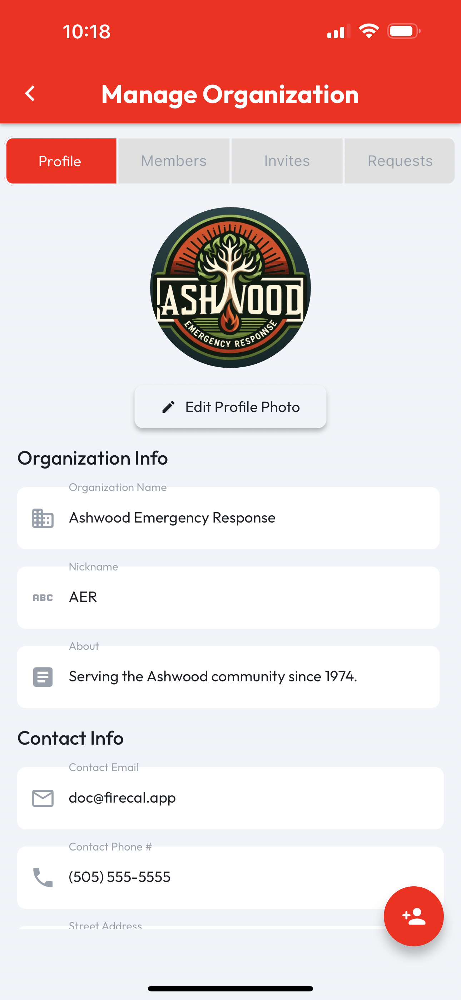

# Edit Org Profile

Managing an organization requires the **Admin** role. Tap **Orgs** on the CertLocker navbar, then tap the **Org Card** to navigate to the **Org Profile** page.

When viewing an **Org Profile**, if you are an administrator, a **Manage** button will be visible in the top right corner of the organization's profile page. Tap this button to proceed to the **Manage Organization** page.

<figure><figcaption></figcaption></figure>

The default tab on the **Manage Organization** page is **Profile**, which includes all the relevant fields for updating the **Org Profile**. Changes will autosave as they're made.
