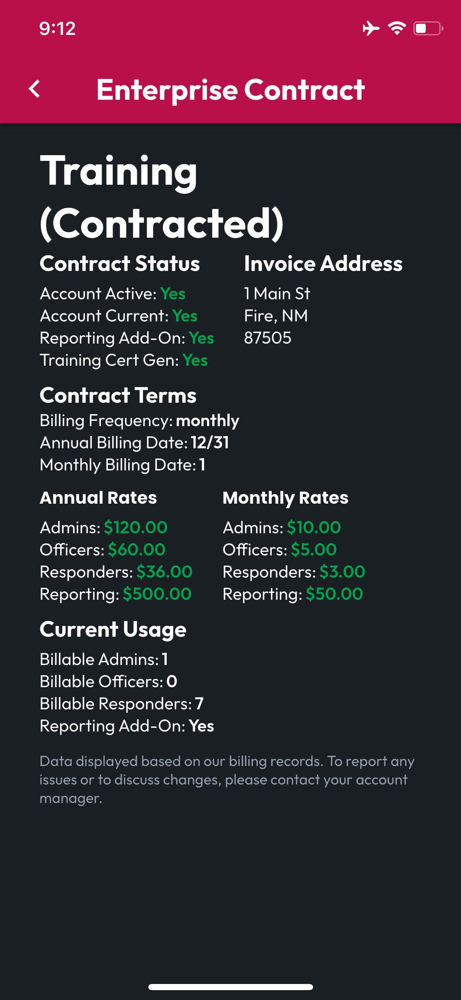

# Enterprise Contract Overview

The Enterprise Contract screen shows the organization’s contract details. It includes pricing, invoice address, contract status, current usage at each billable level, and add-on features selected.

<figure><figcaption></figcaption></figure>
