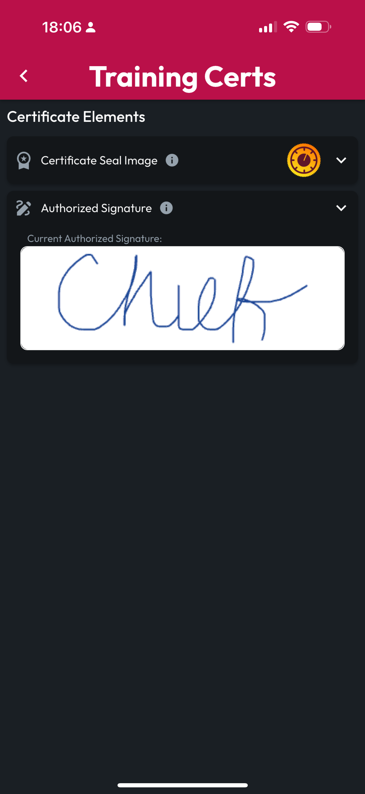
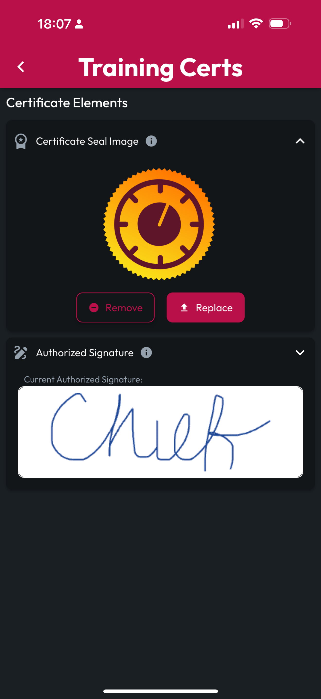
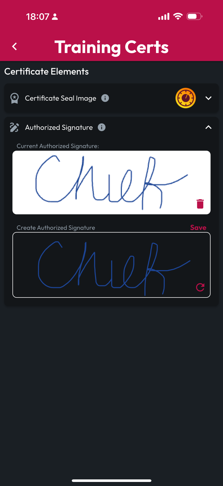

# Training Certificate Generation

Orgs on the Department Tier with the Generate Training Certificates add-on can upload a Certificate Seal Image and Authorized Signature that will appear on Training Certificates generated by CertLocker when this Org hosts a training and enables Certificate Generation for that training.

<figure><figcaption></figcaption></figure>

<figure><figcaption></figcaption></figure>

<figure><figcaption></figcaption></figure>

