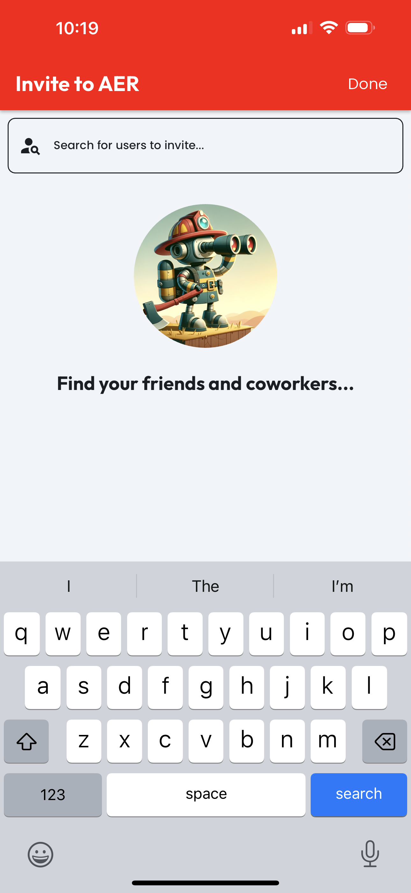
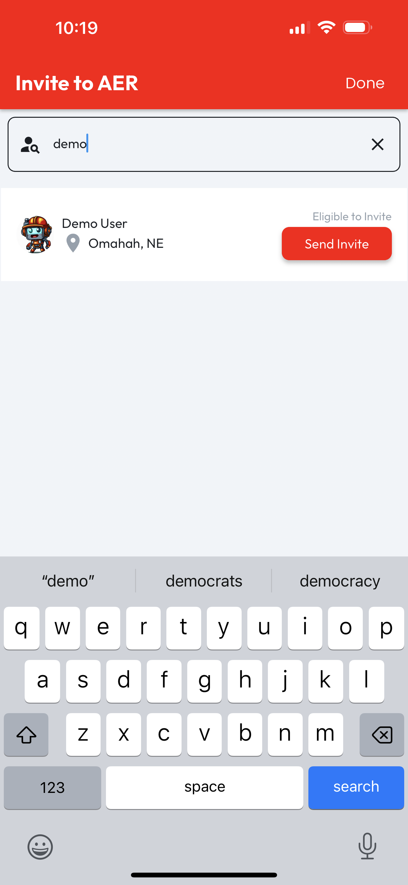

# Invite Member

To Invite a new member to an organization, an Admin role is required. With that role, from any tab on the Manage Organization page, tap the Floating Action Button (FAB) to be taken to the Invite to Org page.

<figure><figcaption></figcaption></figure>

 

<figure><figcaption></figcaption></figure>

This page includes a user seach bar, which will live update with results as you type. Enter any details about the user you'd like to invite, and when you see the correct user, tap the Invite button.

<figure><figcaption></figcaption></figure>
