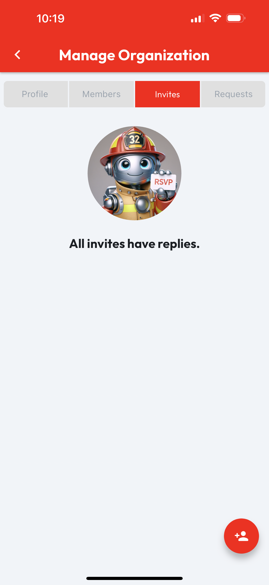
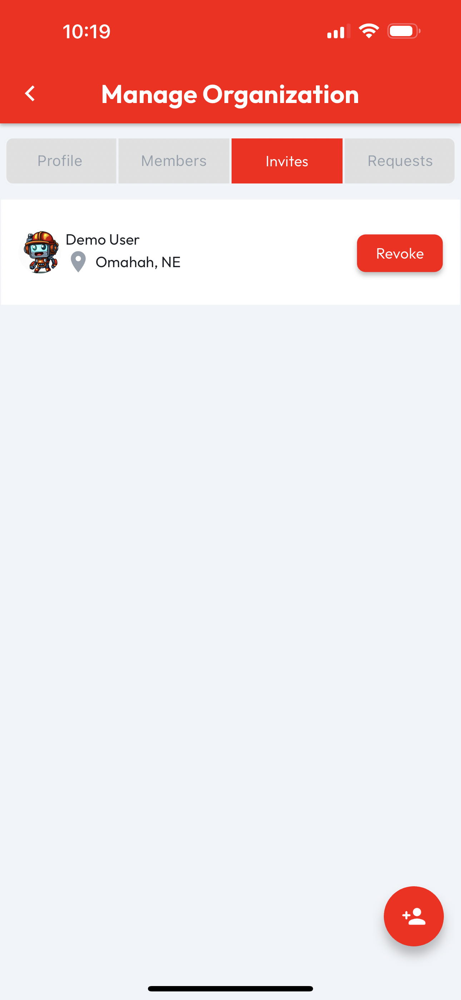

# Manage Invites

Managing an organization's **Invites** requires the **Admin** role. From the **Org Profile**, users with the **Admin** role will see a **Manage** button in the top right corner of the page. Tapping **Manage** will open the **Manage Organization** page. To manage invites, tap on the **Invites** tab. When an organization doesn't have any **Pending Invites**, an empty list image will display, otherwise **Pending Invites** will be listed and include a **Revoke** button, which can be tapped to unsend an **Org Invite**.

<figure><figcaption></figcaption></figure>

 

<figure><figcaption></figcaption></figure>

