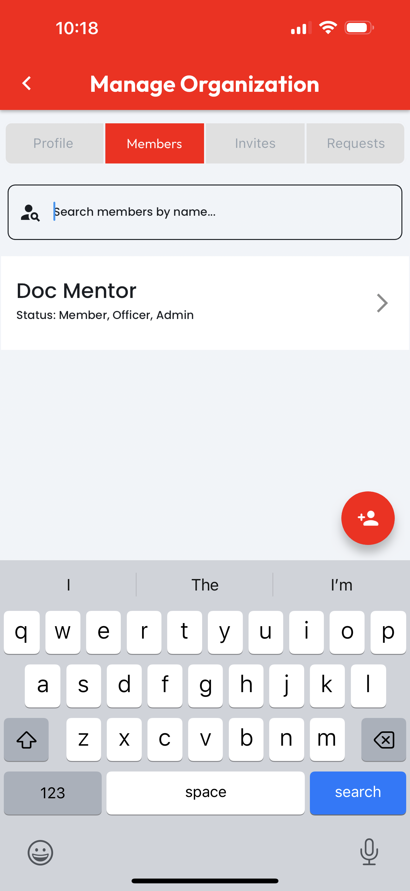
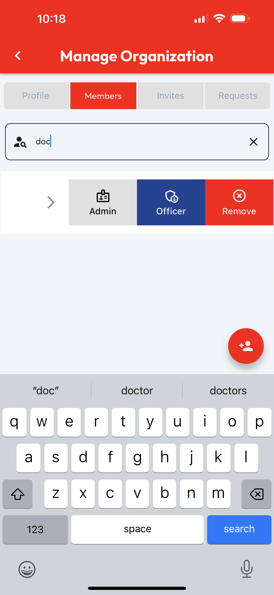

# Manage Members

Managing an organization's members requires the **Admin** role. When viewing an **Org Profile**, users with the **Admin** role will see a **Manage** button in the top right corner.

<figure><figcaption></figcaption></figure>

Tapping the **Manage** button will navigate to the **Manage Organization** page. Tap the **Members** tab to see a searchable list of **Members**. A Member's **Status** shows which roles that Member has in the **Organization** you're managing.

<figure><figcaption></figcaption></figure>

The **List Item** for each member is swipable to access options for managing that user's relationship to the **Org**. The **Admin** and **Officer** buttons are toggles, so tapping one of them will enable or disable the named role, depending on whether the user already has that role.

When managing **User Roles**, reference the **Status** indicator on the user list item to check which roles the listed user has or doesn't have already. When changing roles, a **Success Message** will appear at the bottom when we've finished processing your request.

Finally, in the event that the **Organization** you're managing has parted ways with a listed **User**, the **Remove** button will remove them from the Organization.

<figure><figcaption></figcaption></figure>
