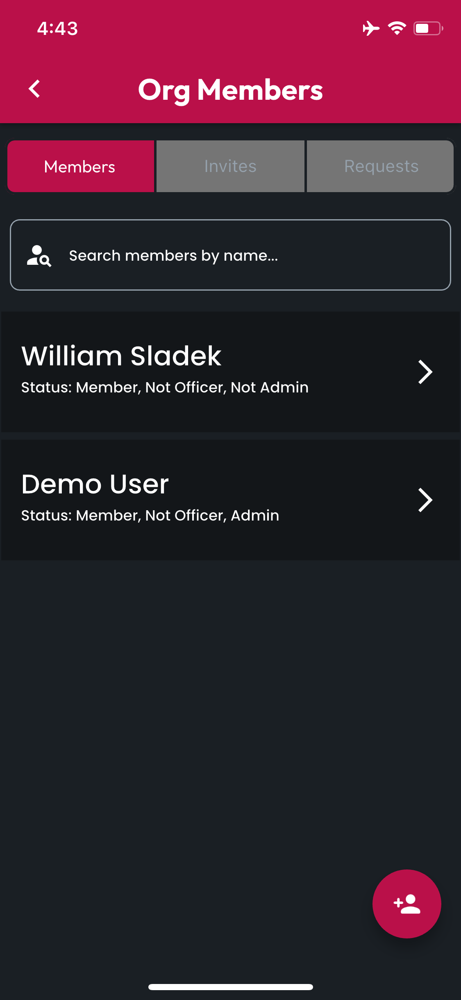
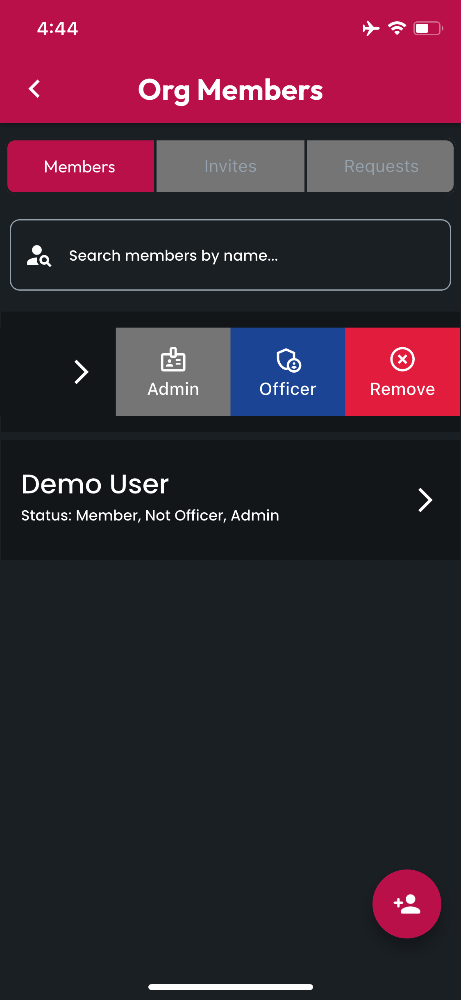
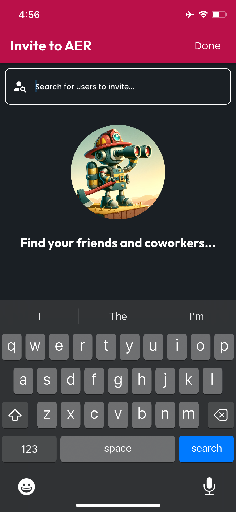
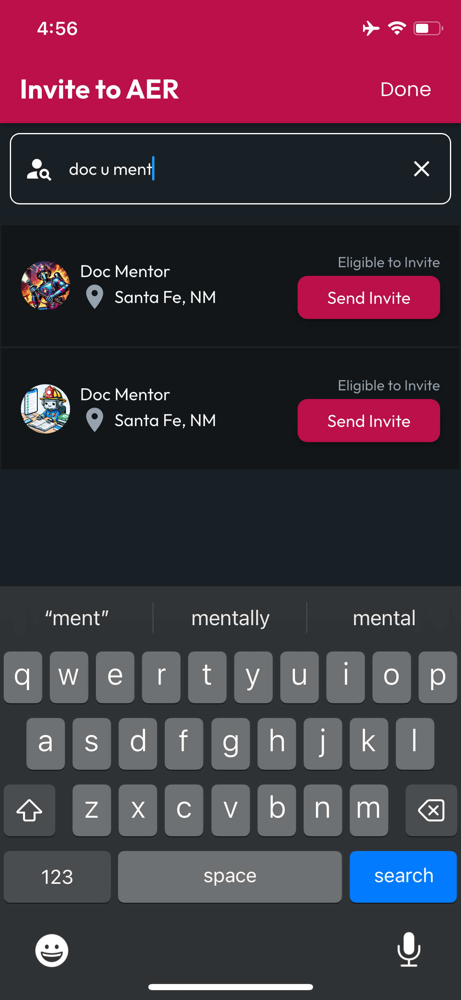
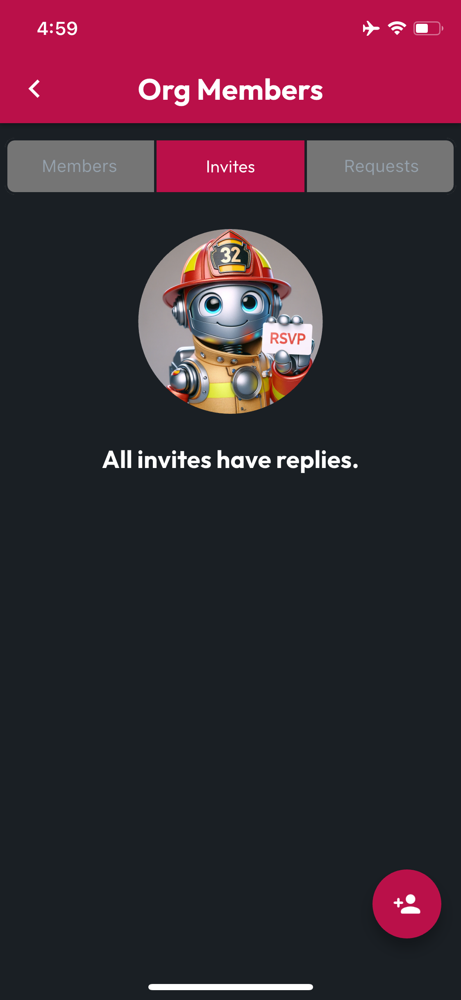
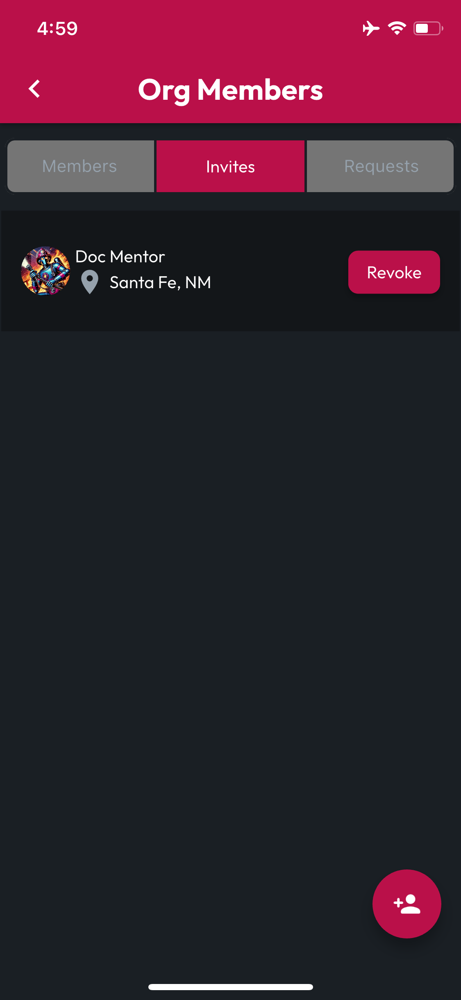
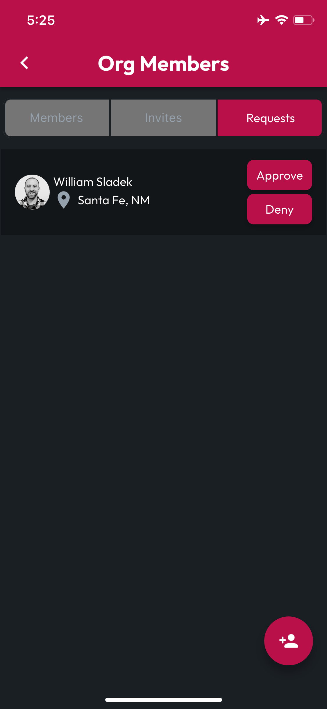

# Manage Members

Managing an organization's members requires the **Admin** role. Check your role by navigating to the Orgs tab, the look at the Org in question to find "My Status". If you're an Admin, your status will be **Administrator**. When viewing an **Org Profile** as an **Admin**, you will see a **Manage** button in the top right corner.

<figure><figcaption></figcaption></figure>

Tapping the **Manage** button will navigate to the **Manage Org** screen, then tap **Manage Members** to access the Org Members screen. Here you can see a searchable list of **Members** and tabs for the **Org's** pending **Invites** and **Requests**.

The **List Item** for each member is swipable to access options for managing that user's relationship to the **Org**. The **Admin** and **Officer** buttons are toggles, so tapping one of them will enable or disable the named role, depending on whether the user already has that role.

<figure><figcaption></figcaption></figure> <figure><figcaption></figcaption></figure>

When managing **User Roles**, reference the **Status** indicator on the user list item to check which roles the listed user has or doesn't have already. When changing roles, a **Success Message** will appear at the bottom when we've finished processing your request.

Finally, in the event that the **Organization** you're managing has parted ways with a listed **User**, the **Remove** button will remove them from the Organization.

## Invite Members

To Invite a new member to an organization, an Admin role is required. With that role, from any tab on the Org Members screen, tap the Floating Action Button (FAB) to be taken to the Invite to Org screen.

<figure><figcaption></figcaption></figure> <figure><figcaption></figcaption></figure>

This page includes a user seach bar, which will live update with results as you type. Enter any details about the user you'd like to invite, and when you see the correct user, tap the Invite button.

<figure><figcaption></figcaption></figure>

## Manage Invites

To manage pending invites, tap on the **Invites** tab. When an organization doesn't have any **Pending Invites**, an empty list image will display, otherwise **Pending Invites** will be listed and include a **Revoke** button, which can be tapped to unsend an **Org Invite**.

<figure><figcaption></figcaption></figure> <figure><figcaption></figcaption></figure>

## Manage Requests

An organization can receive **Requests** from users who would like to be admitted as **Members** of that org. These requests can be **Approved** or **Denied**.

To manage requests, tap on the **Requests** tab. When an organization doesn't have any **Pending Requests**, an empty list image will display, otherwise **Pending Requests** will be listed and include **Approve** and **Deny** buttons, which can be tapped to respond to an **Org Join Request**.

<figure><figcaption></figcaption></figure> <figure><figcaption></figcaption></figure>

