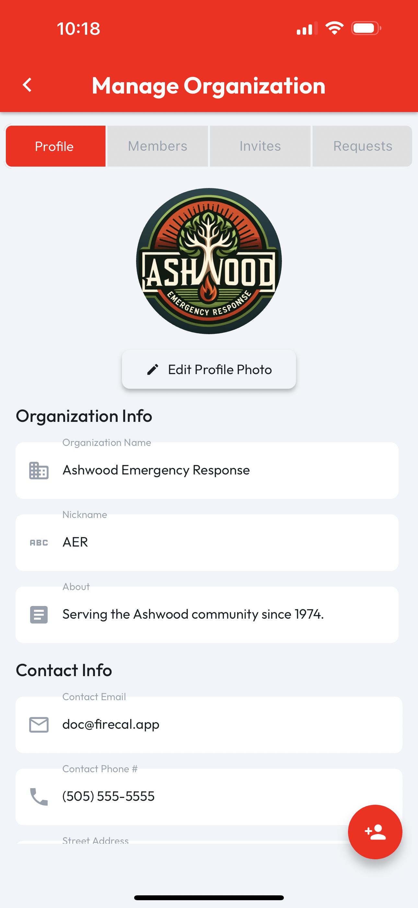
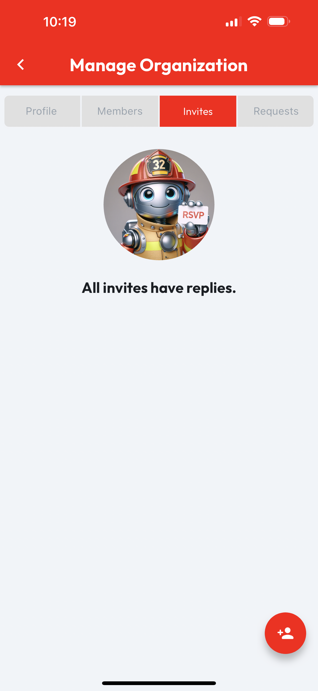
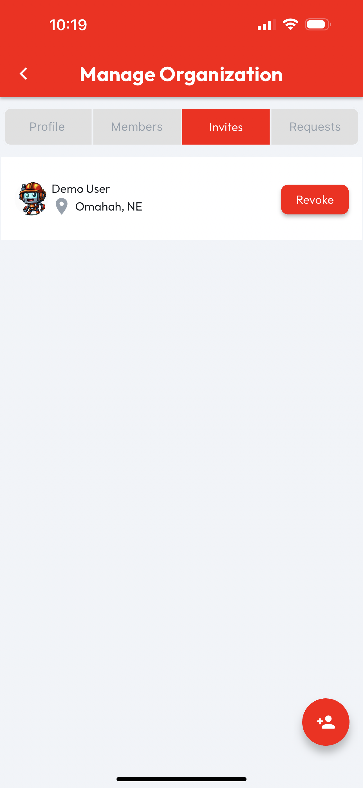

# Manage Members

Managing an organization's members requires the **Admin** role. When viewing an **Org Profile**, users with the **Admin** role will see a **Manage** button in the top right corner.

<figure><figcaption></figcaption></figure>

Tapping the **Manage** button will navigate to the **Manage Organization** page. Tap the **Members** tab to see a searchable list of **Members**. A Member's **Status** shows which roles that Member has in the **Organization** you're managing.

## Invite Members

To Invite a new member to an organization, an Admin role is required. With that role, from any tab on the Manage Organization page, tap the Floating Action Button (FAB) to be taken to the Invite to Org page.

<figure><figcaption></figcaption></figure> <figure><figcaption></figcaption></figure>

This page includes a user seach bar, which will live update with results as you type. Enter any details about the user you'd like to invite, and when you see the correct user, tap the Invite button.

<figure><figcaption></figcaption></figure>

## Manage Invites

Managing an organization's **Invites** requires the **Admin** role. From the **Org Profile**, users with the **Admin** role will see a **Manage** button in the top right corner of the page. Tapping **Manage** will open the **Manage Organization** page. To manage invites, tap on the **Invites** tab. When an organization doesn't have any **Pending Invites**, an empty list image will display, otherwise **Pending Invites** will be listed and include a **Revoke** button, which can be tapped to unsend an **Org Invite**.

<figure><figcaption></figcaption></figure> <figure><figcaption></figcaption></figure>

## Manage Requests

An organization can receive **Requests** from users who would like to be admitted as **Members** of that org. These requests can be **Approved** or **Denied**.

Managing an organization's **Requests** requires the **Admin** role. From the **Org Profile**, users with the **Admin** role will see a **Manage** button in the top right corner of the page. Tapping **Manage** will open the **Manage Organization** page. To manage requests, tap on the **Requests** tab. When an organization doesn't have any **Pending Requests**, an empty list image will display, otherwise **Pending Requests** will be listed and include **Approve** and **Deny** buttons, which can be tapped to respond to an **Org Join Request**.

<figure><figcaption></figcaption></figure> <figure><figcaption></figcaption></figure>

<figure><figcaption></figcaption></figure>

The **List Item** for each member is swipable to access options for managing that user's relationship to the **Org**. The **Admin** and **Officer** buttons are toggles, so tapping one of them will enable or disable the named role, depending on whether the user already has that role.

When managing **User Roles**, reference the **Status** indicator on the user list item to check which roles the listed user has or doesn't have already. When changing roles, a **Success Message** will appear at the bottom when we've finished processing your request.

Finally, in the event that the **Organization** you're managing has parted ways with a listed **User**, the **Remove** button will remove them from the Organization.

<figure><figcaption></figcaption></figure>
