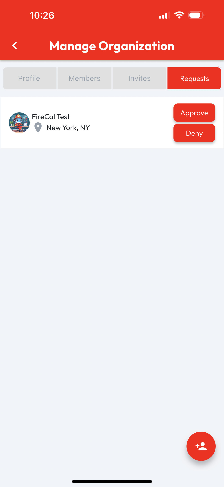

# Manage Requests

An organization can receive **Requests** from users who would like to be admitted as **Members** of that org. These requests can be **Approved** or **Denied**.

Managing an organization's **Requests** requires the **Admin** role. From the **Org Profile**, users with the **Admin** role will see a **Manage** button in the top right corner of the page. Tapping **Manage** will open the **Manage Organization** page. To manage requests, tap on the **Requests** tab. When an organization doesn't have any **Pending Requests**, an empty list image will display, otherwise **Pending Requests** will be listed and include **Approve** and **Deny** buttons, which can be tapped to respond to an **Org Join Request**.

<figure><figcaption></figcaption></figure>

 

<figure><figcaption></figcaption></figure>

