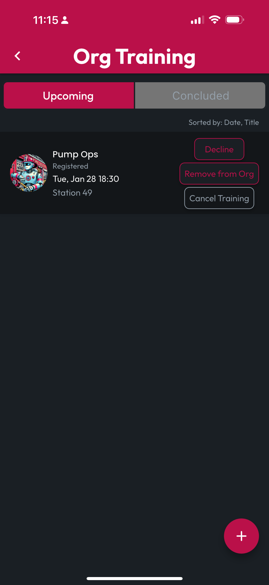
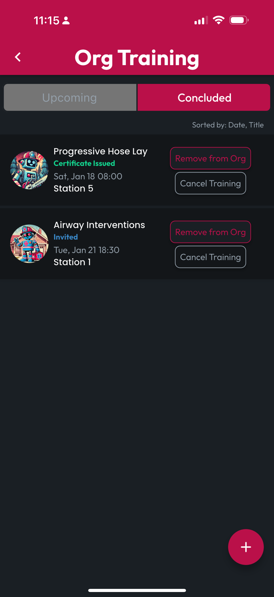

# Manage Training Records

As an Org Admin, you can Manage Training Records where your Org has been added as a Participating Org. These lists are found in two tabs: **Upcoming** for Trainings scheduled in the future, and **Concluded** for Trainings scheduled in the past.

From the Org Training screen, you can manage your Invite status by Accepting or Declining, and you can opt your Org out of participation, by tapping the Remove from Org button.


If you'd like to create a Training hosted by any Org where you're an Admin, by doing so from this screen, the Training Record will automatically originate with this Org as a Participant and the Host.


If you're the creator of a training on the list, you can also cancel the Training, removing it from all engaged Users' training lists. For Concluded trainings, Cancelling will also delete any Generated Certificates.

<figure><figcaption></figcaption></figure> <figure><figcaption></figcaption></figure>

