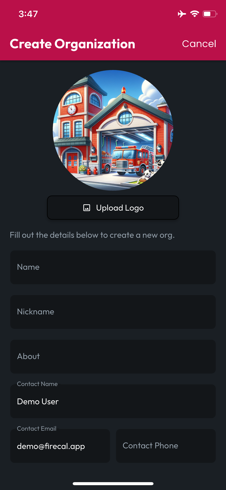

# Create an Org

If you're looking to create an organization in CertLocker, you'll need a subscription at the Officer Tier, or [Contact CertLocker to join at the Department Tier](mailto:sales@firecal.app). Once you have subscribed at the necessary level, navigate to the Orgs tab in the CertLocker navbar, then tap the **Floating Action Button (FAB)** located at the bottom of the screen.

<figure><figcaption></figcaption></figure>

Complete the form, including all required fields, and if you have a Logo, tap the **Upload Logo** button to upload your logo as a JPEG, PNG, GIF, Animated GIF, WebP, Animated WebP, BMP, and WBMP.

<figure><figcaption></figcaption></figure> <figure><figcaption></figcaption></figure>

When you're finished filling out the **Create Organization** form, tap **Create**, and you'll be taken to the **My Orgs** tab where your new **Org** will appear.

<figure><figcaption></figcaption></figure>
