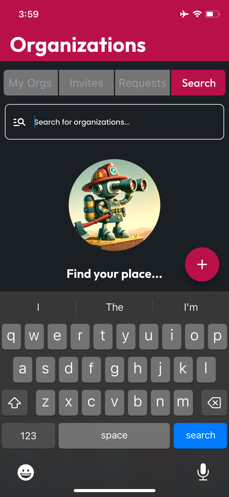
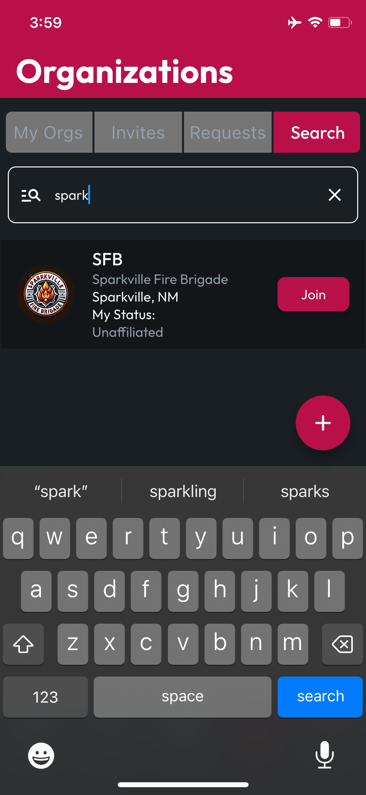
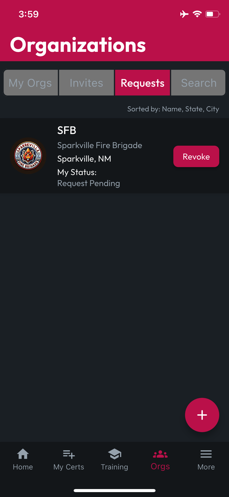

# Finding & Joining Orgs

To find any **Orgs** you'd like to join, tap the **Search** tab. As you type the name of the organization you're looking for, the **Search Results** will live update.

<figure><figcaption></figcaption></figure> <figure><figcaption></figcaption></figure>

When you see the org you're looking for, tap the **Org Card** to view the **Org Profile** or tap the **Join** button to send a request to the organization for review by an administrator. **Pending Requests** will appear on the **Requests** tab.

<figure><figcaption></figcaption></figure>
