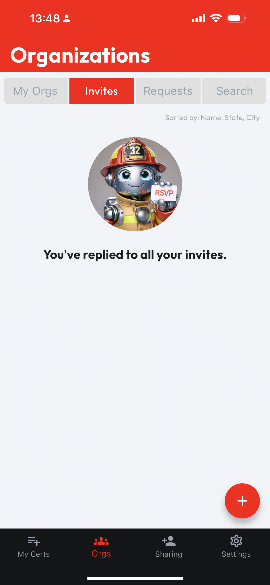
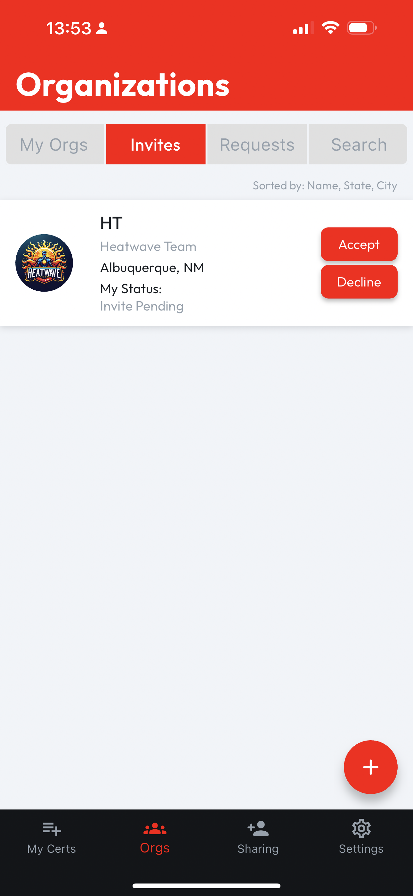

# Manage My Invites

On the **Invites** tab, you can find a list of organizations whose administrators have invited you to join. If you don't have any Pending Invites, this tab will show an empty list image like below.

Each inviting organization is displayed on a distinct card which includes the organization's logo, name and a brief overview, including **My Status**. To view more detailed information about an organization, tapping the **Org Card** will take you to the **Org Profile**.

<figure><figcaption></figcaption></figure>

 

<figure><figcaption></figcaption></figure>

## Accepting or Declining an Invitation

Each organization card includes two buttons: **Accept** and **Decline**.

* To join the organization and become a part of their community, tap the **Accept** button.
* If you decide not to join the organization, tap the **Decline** button.
