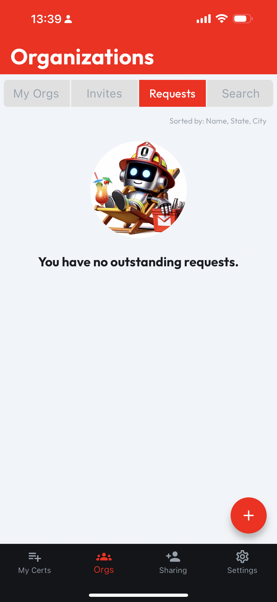

# Manage My Requests

On the **Requests** tab, you can find a list of organizations where you have **Outstanding Requests** to join. If you don't have any **Outstanding Requests**, this tab will show an empty list image like below.

Each organization is displayed on a distinct card which includes the organization's logo, name, and a brief overview, including **My Status**. To view more detailed information about an organization, tapping the **Org Card** will take you to the **Org Profile**.

<figure><figcaption></figcaption></figure>

 

<figure><figcaption></figcaption></figure>

## Revoking a Request

If you would no longer like your request to be considered by an organization, you can tap the **Revoke** button, then the **Organization** will no longer appear in your **Requests** tab.
